---
## Front matter
lang: ru-RU
title: Лабораторная работа №1
subtitle: Основы информационной безопасности
author:
  - Сабралиева М.Н.
institute:
  - Российский университет дружбы народов, Москва, Россия

## i18n babel
babel-lang: russian
babel-otherlangs: english

## Formatting pdf
toc: false
toc-title: Содержание
slide_level: 2
aspectratio: 169
section-titles: true
theme: metropolis
header-includes:
 - \metroset{progressbar=frametitle,sectionpage=progressbar,numbering=fraction}
 - '\makeatletter'
 - '\beamer@ignorenonframefalse'
 - '\makeatother'
---

# Информация

## Докладчик

:::::::::::::: {.columns align=center}
::: {.column width="70%"}

  * Сабралиева Марворид Нуралиевна
  * Студентка направления Бизнес-информатика-01-22
  * кафедра прикладной информатики и теории вероятностей
  * Российский университет дружбы народов
:::
::::::::::::::


# Создание презентации

## Процессор `pandoc`

- Pandoc: преобразователь текстовых файлов
- Сайт: <https://pandoc.org/>
- Репозиторий: <https://github.com/jgm/pandoc>

## Формат `pdf`

- Использование LaTeX
- Пакет для презентации: [beamer](https://ctan.org/pkg/beamer)
- Тема оформления: `metropolis`

## Код для формата `pdf`

```yaml
slide_level: 2
aspectratio: 169
section-titles: true
theme: metropolis
```

## Формат `html`

- Используется фреймворк [reveal.js](https://revealjs.com/)
- Используется [тема](https://revealjs.com/themes/) `beige`

## Код для формата `html`

- Тема задаётся в файле `Makefile`

```make
REVEALJS_THEME = beige 
```

# Элементы презентации

## Цели и задачи

- приобретение практических навыков установки операционной системы на виртуальную машину
- настройки минимально необходимых для дальнейшей работы сервисов

## Содержание исследования

1. Создаю виртуальную машину и задаю конфигурацию жесткого диска 

{#fig:001 width=90%}

##

2. Добавляю новый привод оптического диска и выбираю образ. Запускаю виртуальную машину и начинаю ее настройку с языка для интерфейса 

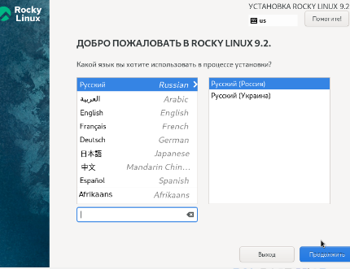{#fig:002 width=90%}

##

3. Указываю параметры установки 

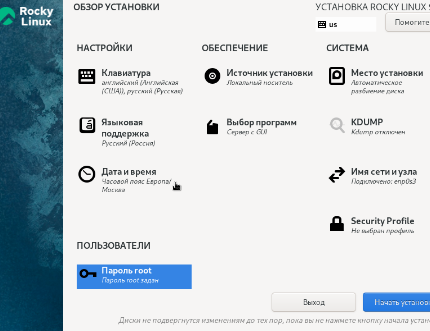{#fig:003 width=90%}

##

4. Перехожу к этапу установки и дожидаюсь его завершения 

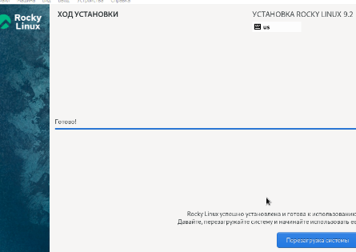{#fig:004 width=90%}

##

5. Загружаю с жесткого диска установленную систему и перехожу к выполнению задания. Ввожу команду dmesg 

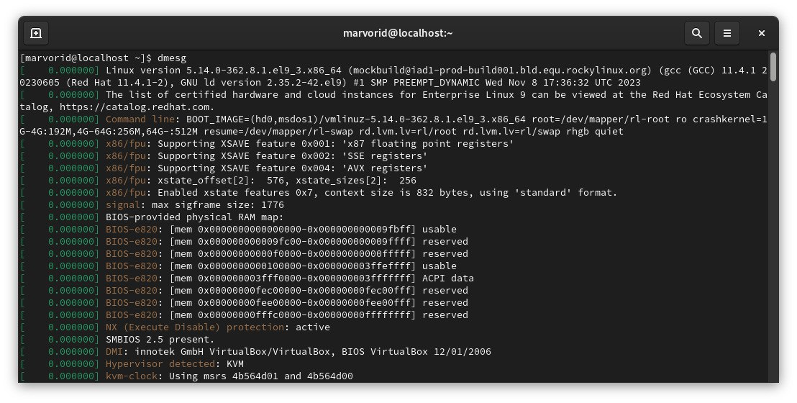{#fig:005 width=90%}

##

6. Вводим команду dmesg | less 

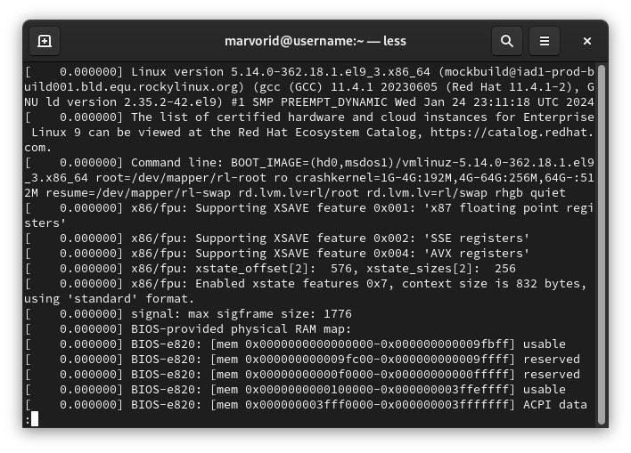{#fig:006 width=90%}

##

7. Узнаем версию ядра Linux (Linux version). 

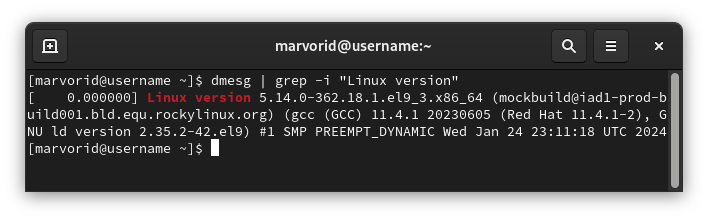{#fig:007 width=90%}

##

8. Узнаем частоту процессора (Detected Mhz processor) 

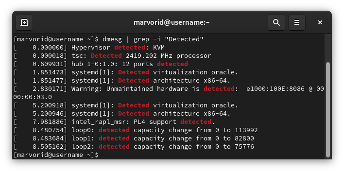{#fig:008 width=90%}

##

9. Модель процессора (CPU0) 

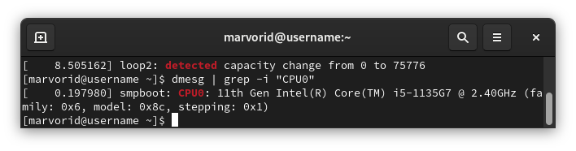{#fig:009 width=90%}

##

10. Объем доступной оперативной памяти (Memory available).

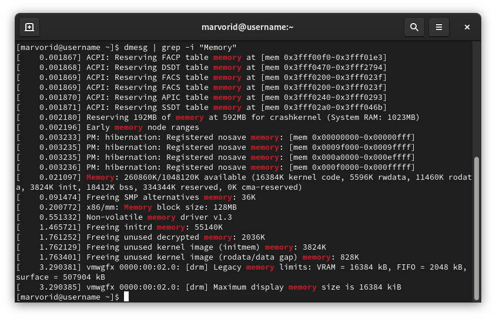{#fig:010 width=90%}

##

11. Тип обнаруженного гипервизора (Hypervisor detected). 

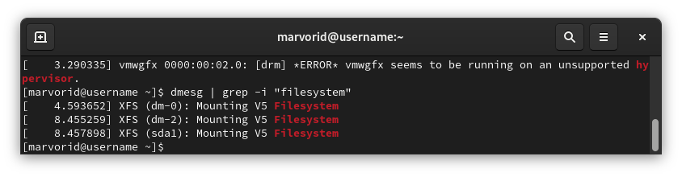{#fig:011 width=90%}

##

12. Тип файловой системы корневого раздела 

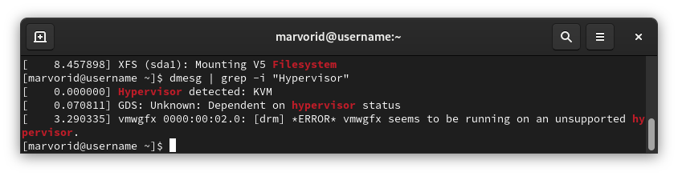{#fig:012 width=90%}

##

13. Последовательность монтирования файловых систем.

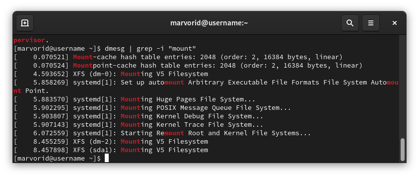{#fig:013 width=90%}


## Результаты

- Мы приобрели практические навыки установки операционной системы на виртуальную машину. 


## Итоговый слайд

- Запоминается последняя фраза. © Штирлиц


:::

