---
## Front matter
title: "Лабораторная          работа №1"
subtitle: "Основы информационной безопасности"
author: "Сабралиева Марворид Нуралиевна"

## Generic otions
lang: ru-RU
toc-title: "Содержание"

## Bibliography
bibliography: bib/cite.bib
csl: pandoc/csl/gost-r-7-0-5-2008-numeric.csl

## Pdf output format
toc: true # Table of contents
toc-depth: 2
lof: true # List of figures
lot: true # List of tables
fontsize: 12pt
linestretch: 1.5
papersize: a4
documentclass: scrreprt
## I18n polyglossia
polyglossia-lang:
  name: russian
  options:
	- spelling=modern
	- babelshorthands=true
polyglossia-otherlangs:
  name: english
## I18n babel
babel-lang: russian
babel-otherlangs: english
## Fonts
mainfont: PT Serif
romanfont: PT Serif
sansfont: PT Sans
monofont: PT Mono
mainfontoptions: Ligatures=TeX
romanfontoptions: Ligatures=TeX
sansfontoptions: Ligatures=TeX,Scale=MatchLowercase
monofontoptions: Scale=MatchLowercase,Scale=0.9
## Biblatex
biblatex: true
biblio-style: "gost-numeric"
biblatexoptions:
  - parentracker=true
  - backend=biber
  - hyperref=auto
  - language=auto
  - autolang=other*
  - citestyle=gost-numeric
## Pandoc-crossref LaTeX customization
figureTitle: "Рис."
tableTitle: "Таблица"
listingTitle: "Листинг"
lofTitle: "Список иллюстраций"
lotTitle: "Список таблиц"
lolTitle: "Листинги"
## Misc options
indent: true
header-includes:
  - \usepackage{indentfirst}
  - \usepackage{float} # keep figures where there are in the text
  - \floatplacement{figure}{H} # keep figures where there are in the text
---

# Цель работы

Целью данной работы является приобретение практических навыков
установки операционной системы на виртуальную машину, настройки ми-
нимально необходимых для дальнейшей работы сервисов.

# Задание

Получите следующую информацию.
1. Версия ядра Linux (Linux version).
2. Частота процессора (Detected Mhz processor).
3. Модель процессора (CPU0).
4. Объем доступной оперативной памяти (Memory available).
5. Тип обнаруженного гипервизора (Hypervisor detected).
6. Тип файловой системы корневого раздела.

# Выполнение лабораторной работы

1. Создаю виртуальную машину и задаю конфигурацию жесткого диска (рис. @fig:001).

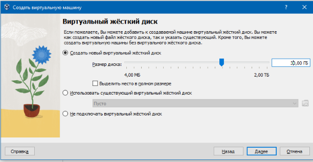{#fig:001 width=90%}

2. Добавляю новый привод оптического диска и выбираю образ. Запускаю виртуальную машину и начинаю ее настройку с языка для интерфейса (рис. @fig:002).

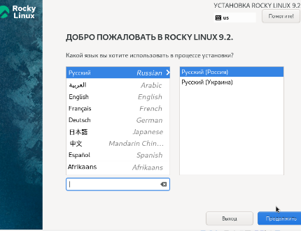{#fig:002 width=90%}

3. Указываю параметры установки (рис. @fig:003).

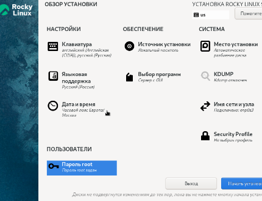{#fig:003 width=90%}

4. Перехожу к этапу установки и дожидаюсь его завершения (рис. @fig:004).

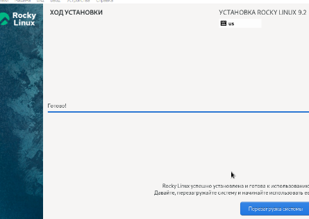{#fig:004 width=90%}

5. Загружаю с жесткого диска установленную систему и перехожу к выполнению задания. Ввожу команду dmesg (рис. @fig:005).

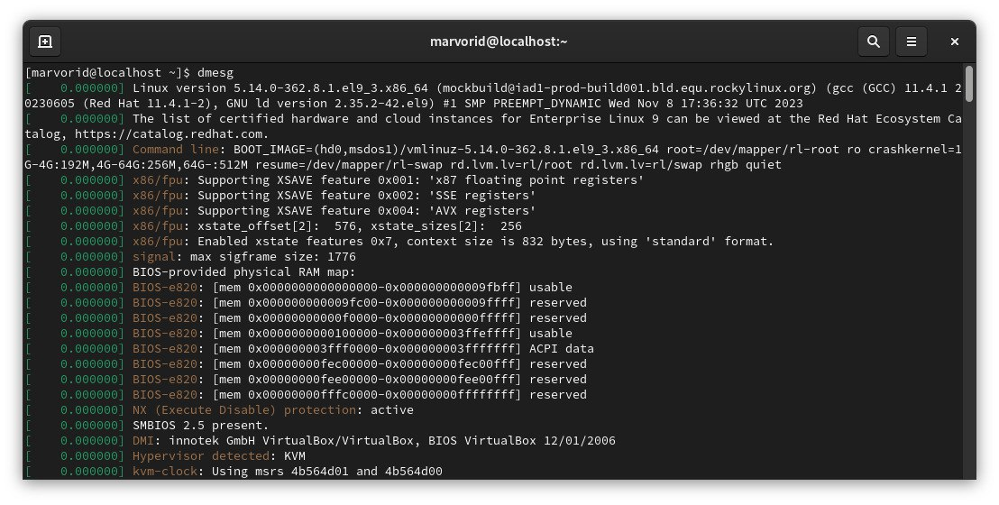{#fig:005 width=90%}

6. Вводим команду dmesg | less (рис. @fig:006).

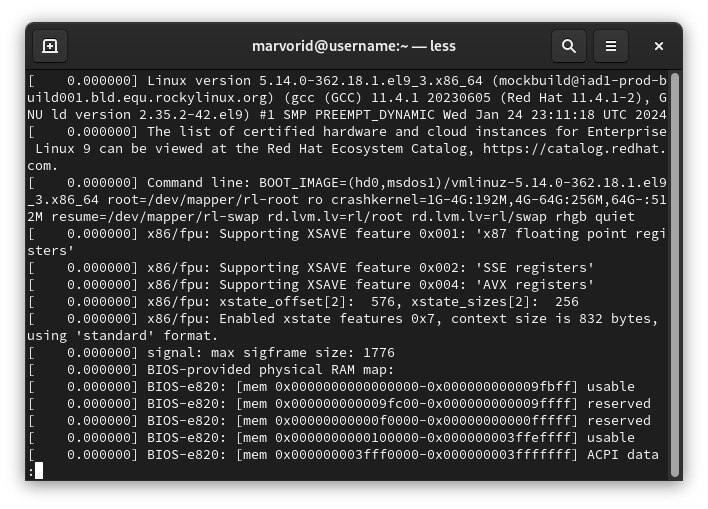{#fig:006 width=90%}

7. Узнаем версию ядра Linux (Linux version). (рис. @fig:007).

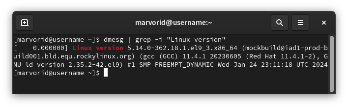{#fig:007 width=90%}

8. Узнаем частоту процессора (Detected Mhz processor) (рис. @fig:008).

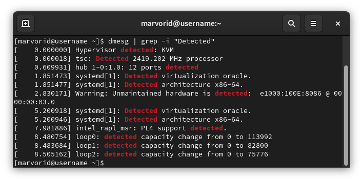{#fig:008 width=90%}

9. Модель процессора (CPU0) (рис. @fig:009).

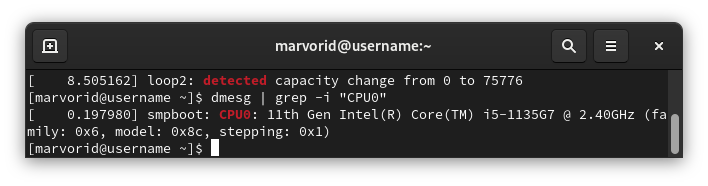{#fig:009 width=90%}

10. Объем доступной оперативной памяти (Memory available).(рис. @fig:010).

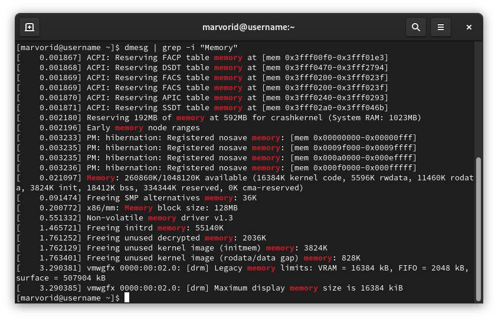{#fig:010 width=90%}

11. Тип обнаруженного гипервизора (Hypervisor detected). (рис. @fig:011).

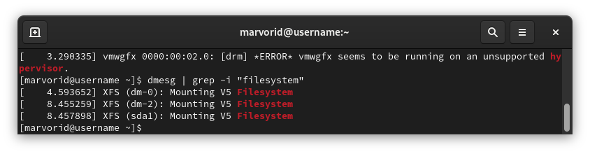{#fig:011 width=90%}

12. Тип файловой системы корневого раздела (рис. @fig:012).

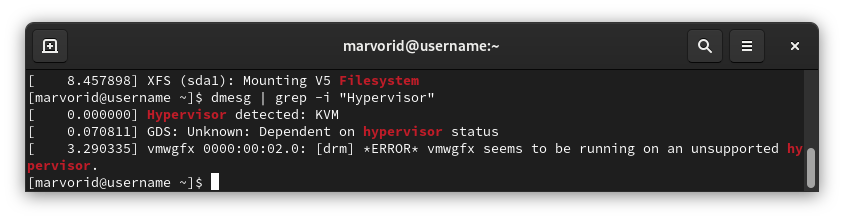{#fig:012 width=90%}

13. Последовательность монтирования файловых систем.(рис. @fig:013).

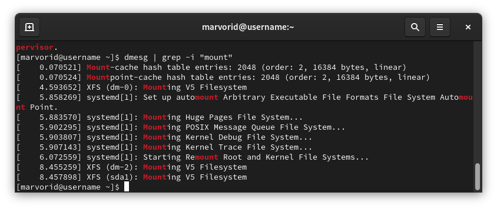{#fig:013 width=90%}

# Выводы

Мы приобрели практические навыки установки операционной системы на виртуальную машину. 

# Список литературы{.unnumbered}

::: {#refs}
:::
