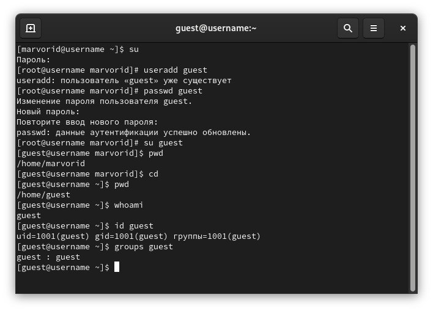
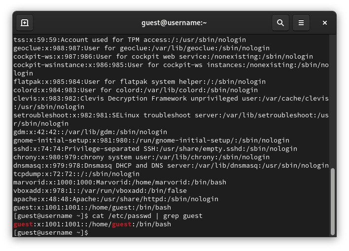
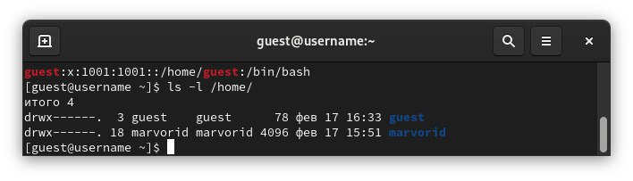
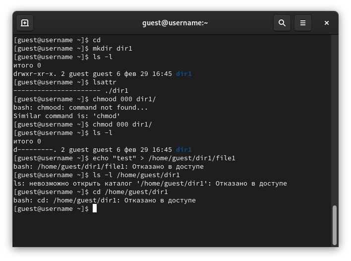
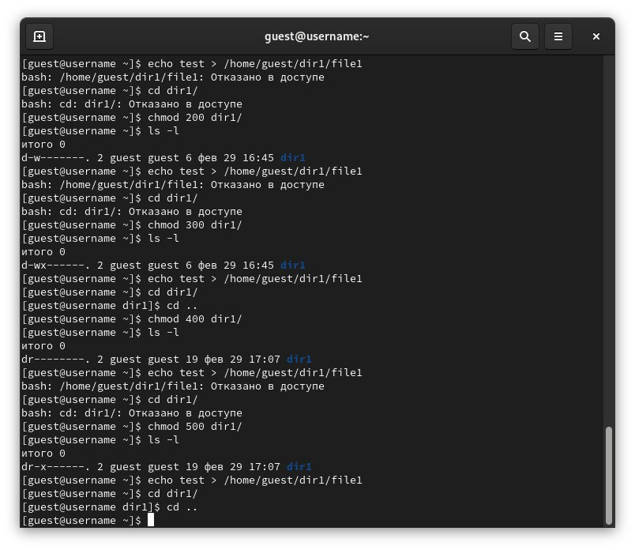
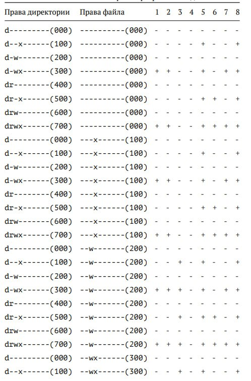
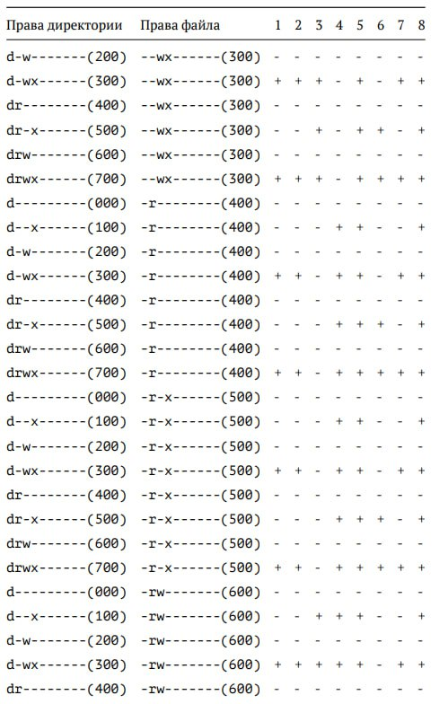
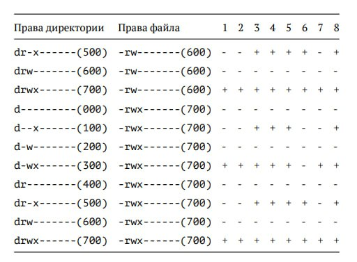
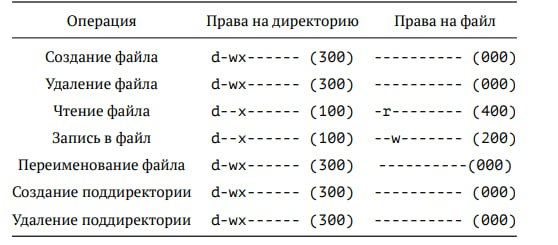

---
## Front matter
lang: ru-RU
title: Лабораторная работа №2
subtitle: Дискреционное разграничение прав в Linux. Основные атрибуты
author:
  - Сабралиева М. Н.
institute:
  - Российский университет дружбы народов, Москва, Россия

## i18n babel
babel-lang: russian
babel-otherlangs: english

## Formatting pdf
toc: false
toc-title: Содержание
slide_level: 2
aspectratio: 169
section-titles: true
theme: metropolis
header-includes:
 - \metroset{progressbar=frametitle,sectionpage=progressbar,numbering=fraction}
 - '\makeatletter'
 - '\beamer@ignorenonframefalse'
 - '\makeatother'
---

# Информация

## Докладчик

:::::::::::::: {.columns align=center}
::: {.column width="70%"}

  * Сабралиева Марворид Нуралиевна
  * ученица кафедры прикладной информатики и теории вероятностей НБИбд-01-22
  * Российский университет дружбы народов

:::
::::::::::::::


## Материалы и методы

- Процессор `pandoc` для входного формата Markdown
- Результирующие форматы
	- `pdf`
	- `html`
- Автоматизация процесса создания: `Makefile`

# Создание презентации

## Код для формата `pdf`

```yaml
slide_level: 2
aspectratio: 169
section-titles: true
theme: metropolis
```

## Формат `html`

- Используется фреймворк [reveal.js](https://revealjs.com/)
- Используется [тема](https://revealjs.com/themes/) `beige`

## Код для формата `html`

- Тема задаётся в файле `Makefile`

```make
REVEALJS_THEME = beige 
```

# Элементы презентации

## Цели и задачи

- Получение практических навыков работы в консоли с атрибутами файлов
- закрепление теоретических основ дискреционного разграничения доступа в современных системах с открытым кодом на базе ОС Linux.

## Содержание исследования


1. В установленной при выполнении предыдущей лабораторной работы
операционной системе создадим учётную запись пользователя guest (использую учётную запись администратора): useradd guest
2. Зададим пароль для пользователя guest (использую учётную запись администратора): passwd guest
3. Войдем в систему от имени пользователя guest.
4. Определим директорию, в которой мы находимся, командой pwd. Сравним её с приглашением командной строки. Определим, является ли она
нашей домашней директорией

##

5. Уточним имя нашего пользователя командой whoami.
6. Уточним имя нашего пользователя, его группу, а также группы, куда входит пользователь, командой id. Выведенные значения uid, gid и др. запомним. Сравним вывод id с выводом команды groups.
7. Сравним полученную информацию об имени пользователя с данными,
выводимыми в приглашении командной строки.

##

{#fig:001 width=90%}

##

8. Просмотрим файл /etc/passwd командой cat /etc/passwd
Найдем в нём свою учётную запись. Определим uid пользователя. Определим gid пользователя. Сравним найденные значения с полученными в предыдущих пунктах. guest имеет те же идентификаторы 

##

{#fig:002 width=90%}

##

9. Определим существующие в системе директории командой ls -l /home/.
10. Проверим, какие расширенные атрибуты установлены на поддиректориях, находящихся в директории /home, командой: lsattr /home Нам не удалось увидеть расширенные атрибуты директорий других пользователей, только своей домашней директории.

##

{#fig:003 width=90%}

##

11. Создали в домашней директории поддиректорию dir1 командой mkdir dir1
Определим командами ls -l и lsattr, какие права доступа и расширенные атрибуты были выставлены на директорию dir1.
12. Снимем с директории dir1 все атрибуты командой chmod 000 dir1 и проверим с её помощью правильность выполнения команды ls -l
13. создали в директории dir1 файл file1 командой echo "test" > /home/guest/dir1/file1. Так как ранее мы отозвали все атрибуты, то тем самым были лишины всех прав на взаимодействие с dir1

##

{#fig:004 width=90%}

##

14. Заполним таблицу «Установленные права и разрешённые действия», выполняя действия от имени владельца директории (файлов), определив опытным путём, какие операции разрешены, а какие нет. Если операция разрешена, занесите в таблицу знак «+», если не разрешена, знак «-».

##

{#fig:005 width=90%}

##

1 - Создание файла
2 - Удаление файла
3 - Запись в файл
4 - Чтение файла
5 - Смена директории
6 - Просмотр файлов в директории
7 - Переименование файла
8 - Смена атрибутов файла

##

{#fig:006 width=90%}

##

{#fig:007 width=90%}

##

{#fig:008 width=90%}

##

{#fig:009 width=90%}


## Результаты

В ходе выполнения лабораторной работы были получены навыки работы с атрибутами файлов и сведения о разграничении доступа


# Итоговый слайд

- Запоминается последняя фраза. © Штирлиц

:::
