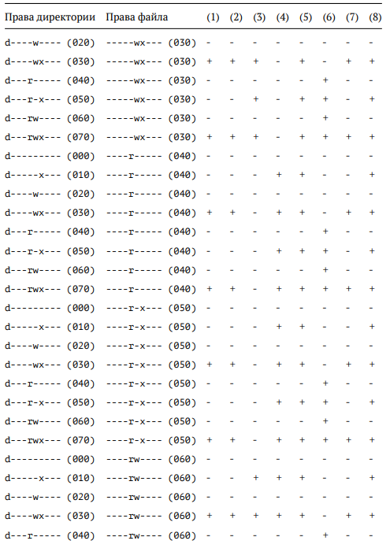

---
## Front matter
lang: ru-RU
title: Лабораторная работа №3
subtitle: Основы информационной безопасности
author:
  - Сабралиева М. Н.
institute:
  - Российский университет дружбы народов, Москва, Россия

## i18n babel
babel-lang: russian
babel-otherlangs: english

## Formatting pdf
toc: false
toc-title: Содержание
slide_level: 2
aspectratio: 169
section-titles: true
theme: metropolis
header-includes:
 - \metroset{progressbar=frametitle,sectionpage=progressbar,numbering=fraction}
 - '\makeatletter'
 - '\beamer@ignorenonframefalse'
 - '\makeatother'
---

# Информация

## Докладчик

:::::::::::::: {.columns align=center}
::: {.column width="70%"}

  * Сабралиева Марворид нуралиевна
  * студентка НБИбд-01-22
  * кафедры прикладной информатики и теории вероятностей
  * Российский университет дружбы народов

:::
::::::::::::::

# Создание презентации

## Формат `pdf`

- Использование LaTeX
- Пакет для презентации: [beamer](https://ctan.org/pkg/beamer)
- Тема оформления: `metropolis`

## Код для формата `pdf`

```yaml
slide_level: 2
aspectratio: 169
section-titles: true
theme: metropolis
```

## Формат `html`

- Используется фреймворк [reveal.js](https://revealjs.com/)
- Используется [тема](https://revealjs.com/themes/) `beige`

## Код для формата `html`

- Тема задаётся в файле `Makefile`

```make
REVEALJS_THEME = beige 
```

# Элементы презентации

## Цели и задачи

- Получение практических навыков работы в консоли с атрибутами фай-
лов для групп пользователей

## Содержание исследования

1. В установленной операционной системе создадим учётную запись пользователя guest (использую учётную запись администратора): useradd guest
2. Задам пароль для пользователя guest (использую учётную запись администратора):passwd guest
3. Аналогично создаю второго пользователя guest2.

##

{#fig:001 width=90%}

##

4. Добавляю пользователя guest2 в группу guest: gpasswd -a guest2 guest

{#fig:002 width=90%}

##

5. Осуществим вход в систему от двух пользователей на двух разных консолях: guest на первой консоли и guest2 на второй консоли.
6. Для обоих пользователей командой pwd определим директорию, в которой мы находимся. Сравним её с приглашениями командной строки. 

##

{#fig:003 width=90%}

##

7. Уточним имя нашего пользователя, его группу, кто входит в неё и к каким группам принадлежит он сам. Определим командами groups guest и groups guest2, в какие группы входят пользователи guest и guest2. Сравните вывод команды groups с выводом команд id -Gn и id -G. 

{#fig:004 width=90%}

##

8. Сравним полученную информацию с содержимым файла /etc/group.
Просмотрим файл командой cat /etc/group 

{#fig:005 width=90%}

##

9. От имени пользователя guest2 выполните регистрацию пользователя
guest2 в группе guest командой newgrp guest.

{#fig:006 width=90%}

##

10. От имени пользователя guest изменим права директории /home/guest,
разрешив все действия для пользователей группы: chmod g+rwx /home/guest
11. От имени пользователя guest снимем с директории /home/guest/dir1 все атрибуты командой chmod 000 dirl и проверим правильность снятия атрибутов. Меняя атрибуты у директории dir1 и файла file1 от имени пользователя guest и делая проверку от пользователя guest2, заполним таблицу, определив опытным путём, какие операции разрешены, а какие нет. Если операция разрешена, занесите в таблицу знак «+», если не разрешена знак «-». Сравним табл. 2.1 (из лабораторной работы No 2) и табл. 3.1. На основании заполненной таблицы определим те или иные минимально необходимые права для выполнения пользователем guest2 операций внутри директории dir1 и заполните табл. 3.2.

##

{#fig:007 width=90%}

##

{#fig:008 width=90%}

##

{#fig:009 width=90%}

##

{#fig:010 width=90%}

##

{#fig:011 width=90%}

##

{#fig:012 width=90%}

##

12. Сравнивая таблицы с такой же таблицей из предыдущей лабораторной работы, могу сказать, что они одинаковы. Единственное различие только в том, что в предыдущей лабораторной работе я присваивала права владельцу, в этот раз группе. 


## Результаты

- В ходе выполнения лабораторной работы, я приобрела практические навыки работы в консоли с атрибутами файлов для групп пользователей. 

## Итоговый слайд

- Запоминается последняя фраза. © Штирлиц


:::

