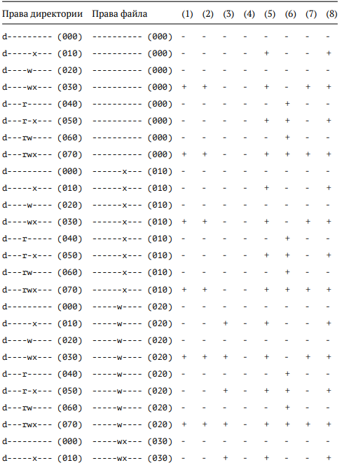

---
## Front matter
title: "Лабораторная работа №3"
subtitle: "Основы информационной безопсности"
author: "Сабралиева Марворид Нуралиевна"

## Generic otions
lang: ru-RU
toc-title: "Содержание"

## Bibliography
bibliography: bib/cite.bib
csl: pandoc/csl/gost-r-7-0-5-2008-numeric.csl

## Pdf output format
toc: true # Table of contents
toc-depth: 2
lof: true # List of figures
lot: true # List of tables
fontsize: 12pt
linestretch: 1.5
papersize: a4
documentclass: scrreprt
## I18n polyglossia
polyglossia-lang:
  name: russian
  options:
	- spelling=modern
	- babelshorthands=true
polyglossia-otherlangs:
  name: english
## I18n babel
babel-lang: russian
babel-otherlangs: english
## Fonts
mainfont: PT Serif
romanfont: PT Serif
sansfont: PT Sans
monofont: PT Mono
mainfontoptions: Ligatures=TeX
romanfontoptions: Ligatures=TeX
sansfontoptions: Ligatures=TeX,Scale=MatchLowercase
monofontoptions: Scale=MatchLowercase,Scale=0.9
## Biblatex
biblatex: true
biblio-style: "gost-numeric"
biblatexoptions:
  - parentracker=true
  - backend=biber
  - hyperref=auto
  - language=auto
  - autolang=other*
  - citestyle=gost-numeric
## Pandoc-crossref LaTeX customization
figureTitle: "Рис."
tableTitle: "Таблица"
listingTitle: "Листинг"
lofTitle: "Список иллюстраций"
lotTitle: "Список таблиц"
lolTitle: "Листинги"
## Misc options
indent: true
header-includes:
  - \usepackage{indentfirst}
  - \usepackage{float} # keep figures where there are in the text
  - \floatplacement{figure}{H} # keep figures where there are in the text
---

# Цель работы

Получение практических навыков работы в консоли с атрибутами фай-
лов для групп пользователей1.

# Выполнение лабораторной работы

1. В установленной операционной системе создадим учётную запись пользователя guest (использую учётную запись администратора): useradd guest
2. Задам пароль для пользователя guest (использую учётную запись ад-
министратора):
passwd guest
3. Аналогично создаю второго пользователя guest2. (рис. @fig:001).

{#fig:001 width=90%}

4. Добавляю пользователя guest2 в группу guest:
gpasswd -a guest2 guest(рис. @fig:002).

{#fig:002 width=90%}

5. Осуществим вход в систему от двух пользователей на двух разных консолях: guest на первой консоли и guest2 на второй консоли.
6. Для обоих пользователей командой pwd определим директорию, в которой мы находимся. Сравним её с приглашениями командной строки. (рис. @fig:003).

{#fig:003 width=90%}

7. Уточним имя нашего пользователя, его группу, кто входит в неё и к каким группам принадлежит он сам. Определим командами groups guest и groups guest2, в какие группы входят пользователи guest и guest2. Сравните вывод команды groups с выводом команд id -Gn и id -G. (рис. @fig:004).

{#fig:004 width=90%}

8. Сравним полученную информацию с содержимым файла /etc/group.
Просмотрим файл командой cat /etc/group (рис. @fig:005).

{#fig:005 width=90%}

9. От имени пользователя guest2 выполните регистрацию пользователя
guest2 в группе guest командой newgrp guest (рис. @fig:006).

{#fig:006 width=90%}

10. От имени пользователя guest изменим права директории /home/guest,
разрешив все действия для пользователей группы: chmod g+rwx /home/guest
11. От имени пользователя guest снимем с директории /home/guest/dir1 все атрибуты командой chmod 000 dirl и проверим правильность снятия атрибутов. Меняя атрибуты у директории dir1 и файла file1 от имени пользователя guest и делая проверку от пользователя guest2, заполним таблицу, определив опытным путём, какие операции разрешены, а какие нет. Если операция разрешена, занесите в таблицу знак «+», если не разрешена знак «-». Сравним табл. 2.1 (из лабораторной работы No 2) и табл. 3.1. На основании заполненной таблицы определим те или иные минимально необходимые права для выполнения пользователем guest2 операций внутри директории dir1 и заполните табл. 3.2.(рис. @fig:007).

{#fig:007 width=90%}

{#fig:008 width=90%}

{#fig:009 width=90%}

{#fig:010 width=90%}

{#fig:011 width=90%}

{#fig:012 width=90%}

12. Сравнивая таблицы с такой же таблицей из предыдущей лабораторной работы, могу сказать, что они одинаковы. Единственное различие только в том, что в предыдущей лабораторной работе я присваивала права владельцу, в этот раз группе. 

# Выводы

В ходе выполнения лабораторной работы, я приобрела практические навыки работы в консоли с атрибутами файлов для групп пользователей. 

# Список литературы{.unnumbered}

::: {#refs}
:::
