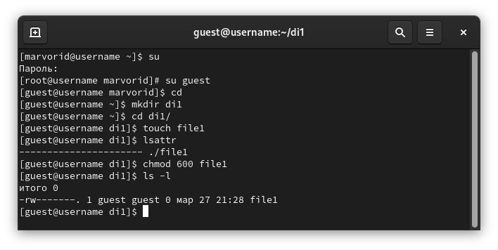
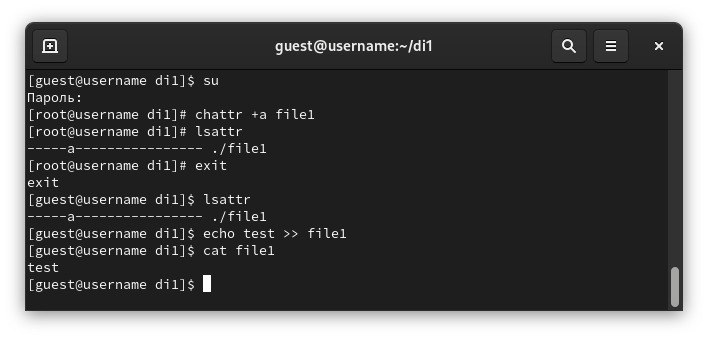
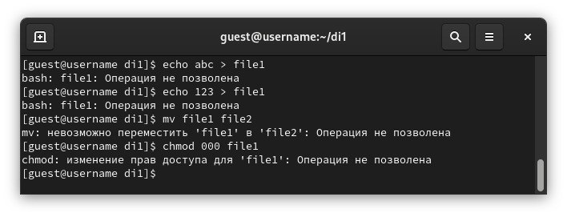
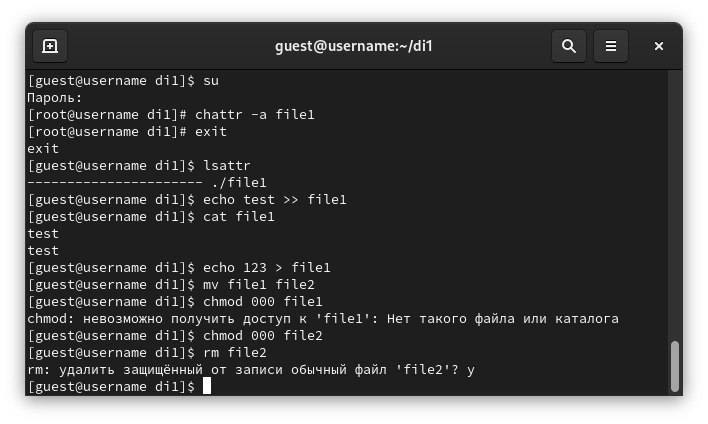
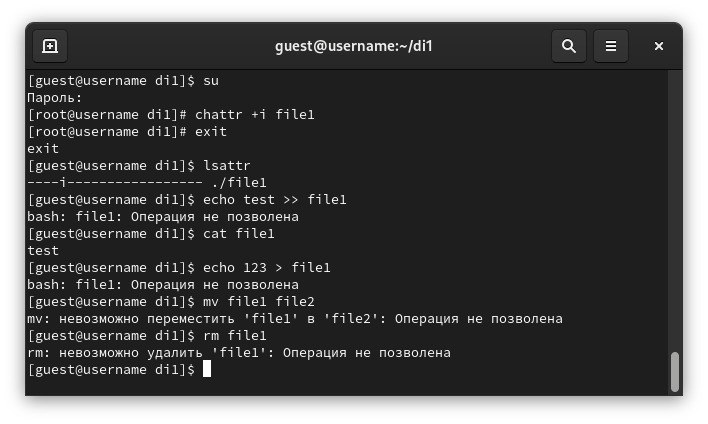

---
## Front matter
lang: ru-RU
title: Лабораторная работа №4
subtitle: Основы информационной безопасности
author:
  - Сабралиева М. Н.
institute:
  - Российский университет дружбы народов, Москва, Россия

## i18n babel
babel-lang: russian
babel-otherlangs: english

## Formatting pdf
toc: false
toc-title: Содержание
slide_level: 2
aspectratio: 169
section-titles: true
theme: metropolis
header-includes:
 - \metroset{progressbar=frametitle,sectionpage=progressbar,numbering=fraction}
 - '\makeatletter'
 - '\beamer@ignorenonframefalse'
 - '\makeatother'
---

# Информация

## Докладчик

:::::::::::::: {.columns align=center}
::: {.column width="70%"}

  * Сабралиева Марворид Нуралиевна
  * студент НБИбд-01-22
  * кафедры прикладной информатики и теории вероятностей
  * Российский университет дружбы народов

:::
::::::::::::::

# Вводная часть

# Создание презентации

## Формат `pdf`

- Использование LaTeX
- Пакет для презентации: [beamer](https://ctan.org/pkg/beamer)
- Тема оформления: `metropolis`

## Код для формата `pdf`

```yaml
slide_level: 2
aspectratio: 169
section-titles: true
theme: metropolis
```

## Код для формата `html`

- Тема задаётся в файле `Makefile`

```make
REVEALJS_THEME = beige 
```

# Элементы презентации


## Цели и задачи

- Получение практических навыков работы в консоли с расширенными
атрибутами файлов.

## Содержание исследования

1. От имени пользователя guest определим расширенные атрибуты файла
/home/guest/dir1/file1 командой lsattr /home/guest/dir1/file1
2. Установим командой chmod 600 file1 на файл file1 права, разрешающие чтение и запись для владельца файла. 

##

{#fig:001 width=90%}

##

3. Попробуем установить на файл /home/guest/dir1/file1 расширенный атрибут a от имени пользователя guest: chattr +a /home/guest/dir1/file1
В ответ мы получили отказ от выполнения операции.
4. Зайдем на третью консоль с правами администратора либо можно повысить свои права с помощью команды su. Попробуем установить расширенный атрибут a на файл /home/guest/dir1/file1 от имени суперпользователя: chattr +a /home/guest/dir1/file1 
Команда выполнилась
5. От пользователя guest проверим правильность установления атрибута: lsattr 

##

6. Выполните дозапись в файл file1 слова «test» командой
echo "test"file1
После этого выполним чтение файла file1 командой cat file1
Проверим, что слово test было успешно записано в file1. 

{#fig:002 width=90%}

##

7. Попробуем удалить файл file1 либо стереть имеющуюся в нём информацию командой echo "abcd" > file1 Попробуем переименовать файл. 
Ничего из этого не выполняется
8. Попробуем с помощью команды chmod 000 file1 установить на файл file1 права, например, запрещающие чтение и запись для владельца файла. 
Данная команда тоже не сработала 

##

{#fig:003 width=90%}

##

9. Снимем расширенный атрибут a с файла /home/guest/dirl/file1 от имени суперпользователя командой chattr -a file1. Повторим операции, которые нам ранее не удавалось выполнить. 
После снятия атрибута -а стало возможно переписать файл, удалить или переименовать. Атрибут -а позволяет только дозаписывать файл 

##

{#fig:004 width=90%}

##

10. Повторим наши действия по шагам, заменив атрибут «a» атрибутом «i».
Удалось ли вам дозаписать информацию в файл? 
Атрибут -i запрещает любое изменение файла: дозапись, переименование, удаление, смену атрибутов 

{#fig:005 width=90%}


## Результаты

В результате выполнения работы мы повысили свои навыки использования интерфейса командой строки (CLI), познакомились на примерах с тем, как используются основные и расширенные атрибуты при разграничении доступа.
Имели возможность связать теорию дискреционного разделения доступа (дискреционная политика безопасности) с её реализацией на практике в ОС Linux. Опробовали действие на практике расширенных атрибутов «а» и «i»

## Итоговый слайд

- Запоминается последняя фраза. © Штирлиц
