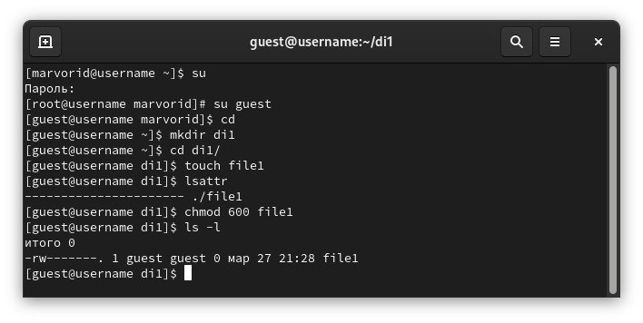
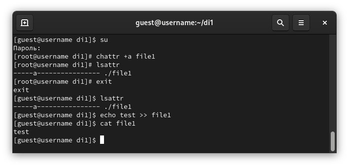
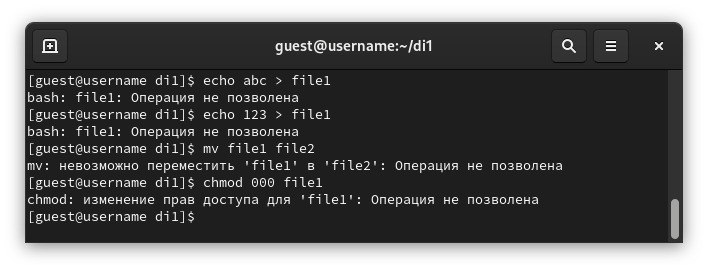
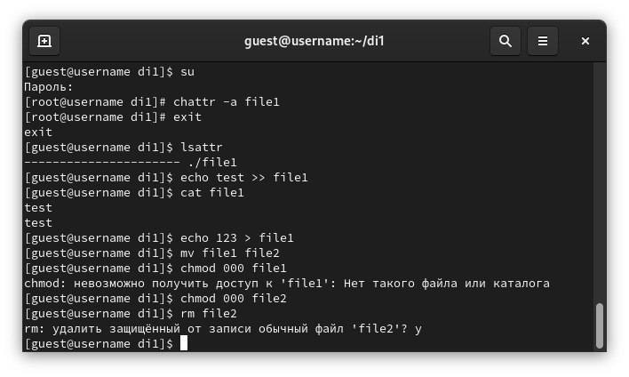
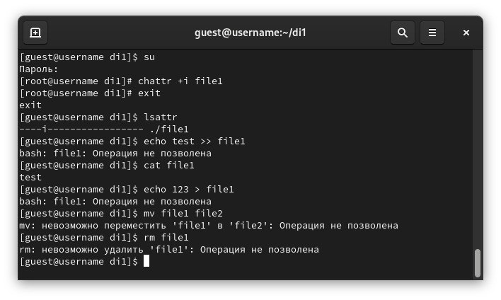

---
## Front matter
title: "Лабораторная работа №4"
subtitle: "Основы информационной безопасности"
author: "Сабралиева Марворид Нуралиевна"

## Generic otions
lang: ru-RU
toc-title: "Содержание"

## Bibliography
bibliography: bib/cite.bib
csl: pandoc/csl/gost-r-7-0-5-2008-numeric.csl

## Pdf output format
toc: true # Table of contents
toc-depth: 2
lof: true # List of figures
lot: true # List of tables
fontsize: 12pt
linestretch: 1.5
papersize: a4
documentclass: scrreprt
## I18n polyglossia
polyglossia-lang:
  name: russian
  options:
	- spelling=modern
	- babelshorthands=true
polyglossia-otherlangs:
  name: english
## I18n babel
babel-lang: russian
babel-otherlangs: english
## Fonts
mainfont: PT Serif
romanfont: PT Serif
sansfont: PT Sans
monofont: PT Mono
mainfontoptions: Ligatures=TeX
romanfontoptions: Ligatures=TeX
sansfontoptions: Ligatures=TeX,Scale=MatchLowercase
monofontoptions: Scale=MatchLowercase,Scale=0.9
## Biblatex
biblatex: true
biblio-style: "gost-numeric"
biblatexoptions:
  - parentracker=true
  - backend=biber
  - hyperref=auto
  - language=auto
  - autolang=other*
  - citestyle=gost-numeric
## Pandoc-crossref LaTeX customization
figureTitle: "Рис."
tableTitle: "Таблица"
listingTitle: "Листинг"
lofTitle: "Список иллюстраций"
lotTitle: "Список таблиц"
lolTitle: "Листинги"
## Misc options
indent: true
header-includes:
  - \usepackage{indentfirst}
  - \usepackage{float} # keep figures where there are in the text
  - \floatplacement{figure}{H} # keep figures where there are in the text
---

# Цель работы

Получение практических навыков работы в консоли с расширенными
атрибутами файлов.

# Выполнение лабораторной работы

1. От имени пользователя guest определим расширенные атрибуты файла
/home/guest/dir1/file1 командой lsattr /home/guest/dir1/file1
2. Установим командой chmod 600 file1 на файл file1 права, разрешающие чтение и запись для владельца файла. (рис. @fig:001).

{#fig:001 width=90%}

3. Попробуем установить на файл /home/guest/dir1/file1 расширенный атрибут a от имени пользователя guest: chattr +a /home/guest/dir1/file1
В ответ мы получили отказ от выполнения операции.
4. Зайдем на третью консоль с правами администратора либо можно повысить свои права с помощью команды su. Попробуем установить расширенный атрибут a на файл /home/guest/dir1/file1 от имени суперпользователя: chattr +a /home/guest/dir1/file1 
Команда выполнилась
5. От пользователя guest проверим правильность установления атрибута: lsattr 
6. Выполните дозапись в файл file1 слова «test» командой
echo "test"file1
После этого выполним чтение файла file1 командой cat file1
Проверим, что слово test было успешно записано в file1. (рис. @fig:002).

{#fig:002 width=90%}

7. Попробуем удалить файл file1 либо стереть имеющуюся в нём информацию командой echo "abcd" > file1 Попробуем переименовать файл. 
Ничего из этого не выполняется
8. Попробуем с помощью команды chmod 000 file1 установить на файл file1 права, например, запрещающие чтение и запись для владельца файла. 
Данная команда тоже не сработала (рис. @fig:003).

{#fig:003 width=90%}

9. Снимем расширенный атрибут a с файла /home/guest/dirl/file1 от имени суперпользователя командой chattr -a file1. Повторим операции, которые нам ранее не удавалось выполнить. 
После снятия атрибута -а стало возможно переписать файл, удалить или переименовать. Атрибут -а позволяет только дозаписывать файл (рис. @fig:004).

{#fig:004 width=90%}

10. Повторим наши действия по шагам, заменив атрибут «a» атрибутом «i».
Удалось ли вам дозаписать информацию в файл? 
Атрибут -i запрещает любое изменение файла: дозапись, переименование, удаление, смену атрибутов (рис. @fig:005).

{#fig:005 width=90%}

# Выводы

В результате выполнения работы мы повысили свои навыки использования интерфейса командой строки (CLI), познакомились на примерах с тем, как используются основные и расширенные атрибуты при разграничении доступа. Имели возможность связать теорию дискреционного разделения доступа (дискреционная политика безопасности) с её реализацией на практике в ОС Linux. Опробовали действие на практике расширенных атрибутов «а» и «i»

# Список литературы{.unnumbered}

::: {#refs}
:::
