---
## Front matter
lang: ru-RU
title: Лабораторная работа №5
subtitle: Основы информационной безопасности
author:
  - Сабралиева М. Н.
institute:
  - Российский университет дружбы народов, Москва, Россия

## i18n babel
babel-lang: russian
babel-otherlangs: english

## Formatting pdf
toc: false
toc-title: Содержание
slide_level: 2
aspectratio: 169
section-titles: true
theme: metropolis
header-includes:
 - \metroset{progressbar=frametitle,sectionpage=progressbar,numbering=fraction}
 - '\makeatletter'
 - '\beamer@ignorenonframefalse'
 - '\makeatother'
---

# Информация

## Докладчик

:::::::::::::: {.columns align=center}
::: {.column width="70%"}

  * Сабралиева Марворид Нуралиевна
  * студентка НБИбд-01-22 кафедры прикладной информатики и теории вероятностей
  * Российский университет дружбы народов

:::
::::::::::::::

# Элементы презентации

## Цели и задачи

- Изучение механизмов изменения идентификаторов, применения SetUID- и Sticky-битов. 
- Получение практических навыков работы в консоли с дополнительными атрибутами. 
- Рассмотрение работы механизма смены идентификатора процессов пользователей, а также влияние бита Sticky на запись и удаление файлов.

## Подготовка

1. Для выполнения части заданий потребуются средства разработки приложений. В частности, при подготовке стенда следует убедиться, что в системе установлен компилятор gcc. У меня его не было, поэтому я установила компилятор
2. Система защиты SELinux не должна мешать выполнению заданий работы. Если вы не знаете, что это такое, просто отключите систему запретов до очередной перезагрузки системы командой setenforce 0
3. Команда getenforce выводит Permissive.

##

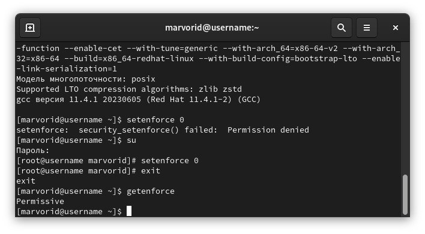{#fig:001 width=90%}

## Изучение механики SetUID

1. Вошли в систему от имени пользователя guest. 

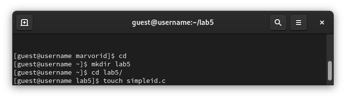{#fig:002 width=90%}

##

2. Создаем программу simpleid.c: 

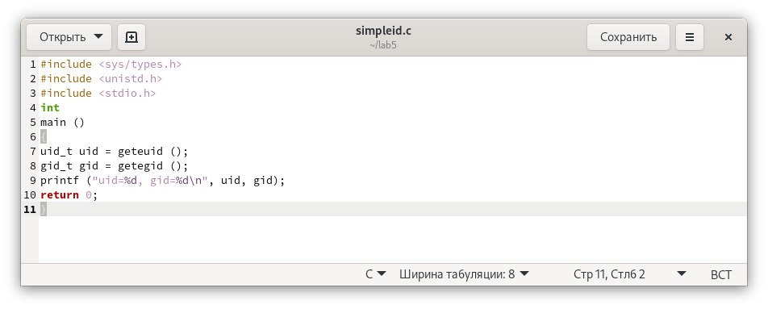{#fig:003 width=90%}

##

3. Скомплилируем программу и убедимся, что файл программы создан: gcc simpleid.c -o simpleid
4. Выполним программу simpleid: ./simpleid
5. Выполним системную программу id: id и сравните полученный вами результат с данными предыдущего пункта задания. uid и gid совпадают в обеих программах.

##

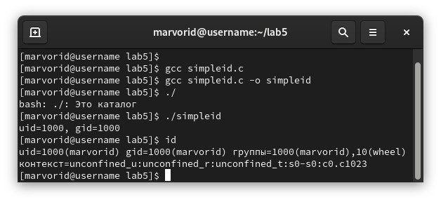{#fig:004 width=90%}

##

6. Усложним программу, добавив вывод действительных идентификаторов
Получившуюся программу назовем simpleid2.c.

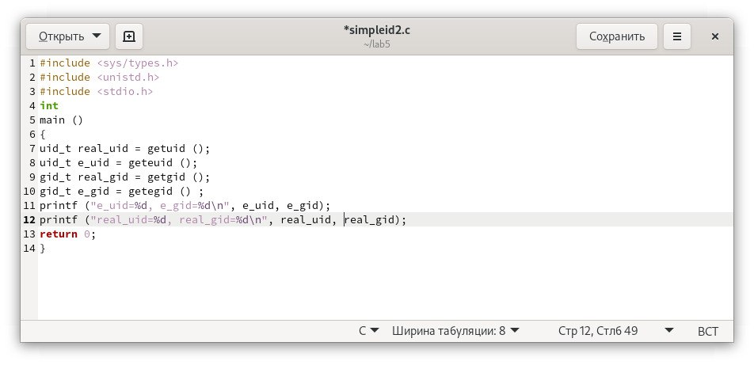{#fig:005 width=90%}

##

7. Скомпилируем и запустим simpleid2.c: gcc simpleid2.c -o simpleid2
./simpleid2.

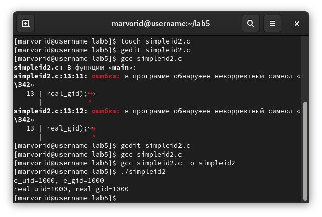{#fig:006 width=90%}

##

8. От имени суперпользователя выполним команды: 
chown root:guest /home/guest/simpleid2
chmod u+s /home/guest/simpleid2  

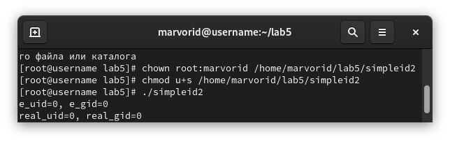{#fig:007 width=90%}

##

9. Используем su для повышения своих прав.
10. Выполним проверку правильности установки новых атрибутов и смены
владельца файла simpleid2: ls -l simpleid2
11. Запустим simpleid2 и id: ./simpleid2   id
Результаты выполнения теперь немного отличаются
12. Проделаем тоже самое относительно SetGID-бита. .

##

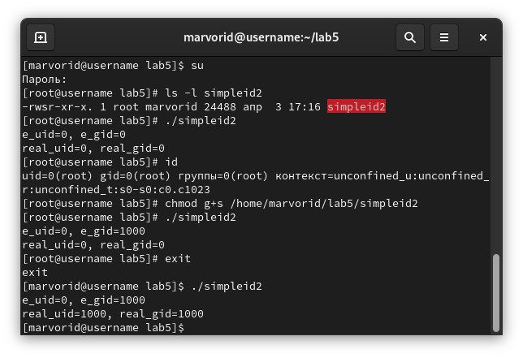{#fig:008 width=90%}

##

13. Создадим программу readfile.c.

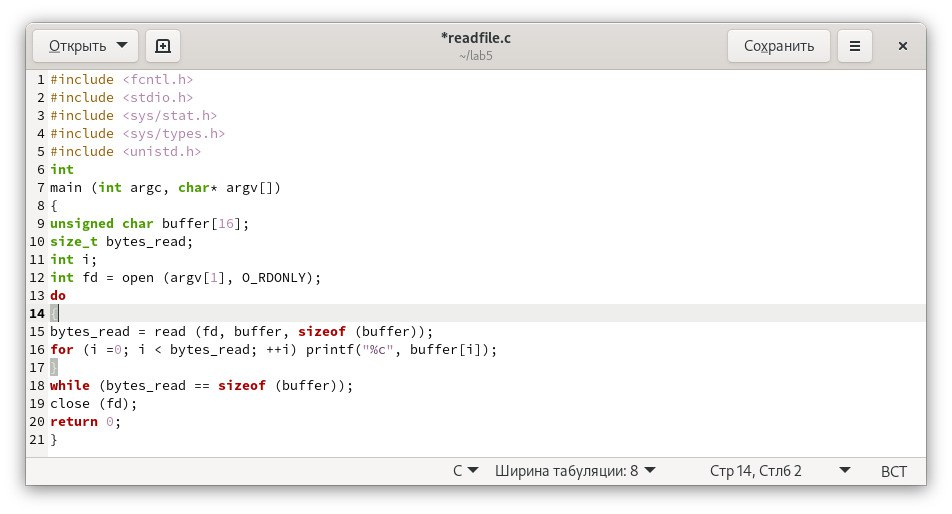{#fig:009 width=90%}

##

14. Откомпилируем её. gcc readfile.c -o readfile.
15. Смениим владельца у файла readfile.c и изменим права так, чтобы только суперпользователь (root) мог прочитать его, a пользователь не мог.
16. Проверили, что пользователь не может прочитать файл readfile.c.
17. Сменим у программы readfile владельца и установим SetU’D-бит.
18. Проверили, может ли программа readfile прочитать файл readfile.c?
19. Проверили, может ли программа readfile прочитать файл /etc/shadow

##

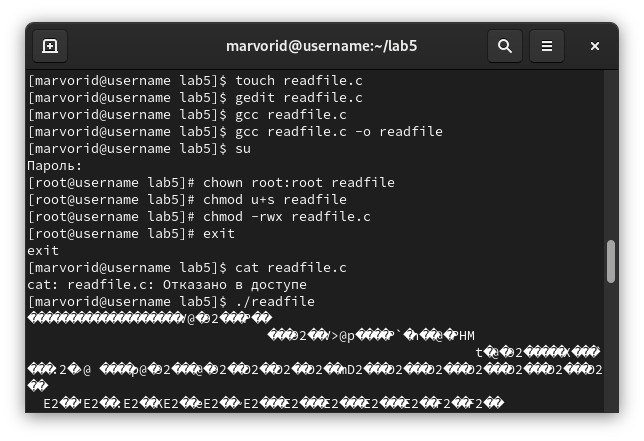{#fig:010 width=90%}

## Исследование Sticky-бита

1. Выяснили, что установлен атрибут Sticky на директории /tmp, для чего выполните команду ls -l / | grep tmp
2. От имени пользователя создали файл file01.txt в директории  tmp со словом test: echo "test" > /tmp/file01.txt
3. Просмотрели атрибуты у только что созданного файла и разрешили чтение и запись для категории пользователей «все остальные»:
ls -l /tmp/file01.txt
chmod o+rw /tmp/file01.txt
ls -l /tmp/file01.txt
4. От пользователя guest2 (не являющегося владельцем) попробовали прочитать файл /tmp/file01.txt: cat /tmp/file01.txt
5. От пользователя guest2 попробовали дозаписать в файл /tmp/file01.txt слово test2 командой echo "test2" > /tmp/file01.txt
операцию не удалась
6. Проверили содержимое файла командой cat /tmp/file01.txt

##

7. От пользователя guest2 попробовали записать в файл /tmp/file01.txt
слово test3, стерев при этом всю имеющуюся в файле информацию ко-
мандой echo "test3" > /tmp/file01.txt
8. Проверили содержимое файла командой cat /tmp/file01.txt
9. От пользователя guest2 попробовали удалить файл /tmp/file01.txt командой rm /tmp/fileOl.txt, но получили отказ
10. Повысили свои права до суперпользователя следующей командой
su - и выполнили после этого команду, снимающую атрибут t (Sticky-бит) с директории /tmp: chmod -t /tmp
11. Покинули режим суперпользователя командой exit
12. От пользователя guest2 проверили, что атрибута t у директории /tmp
нет: ls -l / | grep tmp
13. Повторили предыдущие шаги. 
14. Удалось удалить файл от имени пользователя не являющегося владельцем.

##

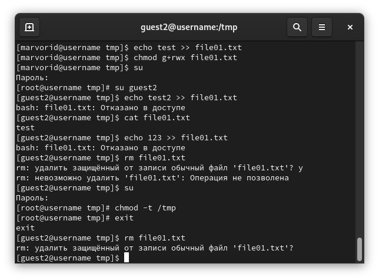{#fig:011 width=90%}

##

15. Повысили свои права до суперпользователя и вернули атрибут t на директорию /tmp: su -
chmod +t /tmp
exit

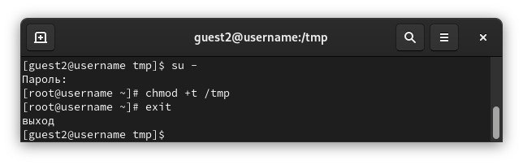{#fig:012 width=90%}

## Результаты

- Изучили механизмы изменения идентификаторов, применения
SetUID- и Sticky-битов. 
- Получмли практические навыки работы в консоли с дополнительными атрибутами. 
- Рассмотрели работы механизма смены идентификатора процессов пользователей, а также влияние бита Sticky на запись и удаление файлов

## Итоговый слайд

- Запоминается последняя фраза. © Штирлиц

:::

