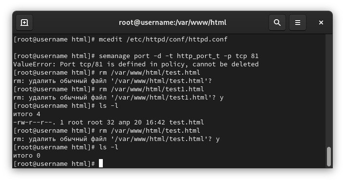

---
## Front matter
title: "Лабораторная работа №6"
subtitle: "Оснновы информационной безопасности"
author: "Сабралиева Марворид Нуралиевна"

## Generic otions
lang: ru-RU
toc-title: "Содержание"

## Bibliography
bibliography: bib/cite.bib
csl: pandoc/csl/gost-r-7-0-5-2008-numeric.csl

## Pdf output format
toc: true # Table of contents
toc-depth: 2
lof: true # List of figures
lot: true # List of tables
fontsize: 12pt
linestretch: 1.5
papersize: a4
documentclass: scrreprt
## I18n polyglossia
polyglossia-lang:
  name: russian
  options:
	- spelling=modern
	- babelshorthands=true
polyglossia-otherlangs:
  name: english
## I18n babel
babel-lang: russian
babel-otherlangs: english
## Fonts
mainfont: PT Serif
romanfont: PT Serif
sansfont: PT Sans
monofont: PT Mono
mainfontoptions: Ligatures=TeX
romanfontoptions: Ligatures=TeX
sansfontoptions: Ligatures=TeX,Scale=MatchLowercase
monofontoptions: Scale=MatchLowercase,Scale=0.9
## Biblatex
biblatex: true
biblio-style: "gost-numeric"
biblatexoptions:
  - parentracker=true
  - backend=biber
  - hyperref=auto
  - language=auto
  - autolang=other*
  - citestyle=gost-numeric
## Pandoc-crossref LaTeX customization
figureTitle: "Рис."
tableTitle: "Таблица"
listingTitle: "Листинг"
lofTitle: "Список иллюстраций"
lotTitle: "Список таблиц"
lolTitle: "Листинги"
## Misc options
indent: true
header-includes:
  - \usepackage{indentfirst}
  - \usepackage{float} # keep figures where there are in the text
  - \floatplacement{figure}{H} # keep figures where there are in the text
---

# Цель работы

Развить навыки администрирования ОС Linux. Получить первое практическое знакомство с технологией SELinux1.
Проверить работу SELinx на практике совместно с веб-сервером Apache.

# Выполнение лабораторной работы

## Подготовка 

1. Установили httpd

2. Задали имя сервера

3. Открыли порты для работы с протоколом http

## Изучение механики SetUID

1. Войдем в систему с полученными учётными данными и убедимся, что
SELinux работает в режиме enforcing политики targeted с помощью команд getenforce и sestatus.

2. Обратимся с помощью браузера к веб-серверу, запущенному на вашем компьютере, и убедимся, что последний работает: service httpd status
или /etc/rc.d/init.d/httpd status
Если не работает, запустить его можно так же, но с параметром start.

{#fig:001 width=90%}

3. Найдем веб-сервер Apache в списке процессов, определите его контекст
безопасности. Например, можно использовать команду ps auxZ | grep httpd
или ps -eZ | grep httpd (рис. @fig:002).

{#fig:002 width=90%}

4. Посмотрим текущее состояние переключателей SELinux для Apache с помощью команды sestatus -bigrep httpd. Обратим внимание, что многие из них находятся в положении «off». (рис. @fig:003).

{#fig:003 width=90%}

5. Посмотрим статистику по политике с помощью команды seinfo, также
определим множество пользователей, ролей, типов. (рис. @fig:004).

{#fig:004 width=90%}

6. Определим тип файлов и поддиректорий, находящихся в директории
/var/www, с помощью команды ls -lZ /var/www  
7. Определим тип файлов, находящихся в директории /var/www/html: ls -lZ /var/www/html

8. Определим круг пользователей, которым разрешено создание файлов в
директории /var/www/html.
9. Создадим от имени суперпользователя (так как в дистрибутиве после установки только ему разрешена запись в директорию) html-файл /var/www/html/test.html следующего содержания:
<html>
<body>test</body>
</html>

10. Проверьте контекст созданного вами файла. 

11. Обратитимся к файлу через веб-сервер, введя в браузере адрес http://127.0.0.1/test.html. Файл был успешно отображён. 

{#fig:005 width=90%}

12. Изучите справку man httpd_selinux и выясните, какие контек-
сты файлов определены для httpd. Сопоставьте их с типом файла
test.html. (рис. @fig:006).
Проверить контекст файла можно командой ls -Z. 
Рассмотрим полученный контекст детально. Обратите внимание, что так как по умолчанию пользователи CentOS являются свободными от типа (unconfined в переводе с англ. означает свободный), созданному нами файлу test.html был сопоставлен SELinux, пользователь unconfined_u. Это первая часть контекста. Далее политика ролевого разделения доступа RBAC используется процессами, но не файлами, поэтому роли не имеют никакого значения для файлов. Роль object_r используется по умолчанию для файлов на «постоянных» носителях и на сетевых файловых системах. (В директории к/ргос файлы, относящиеся к процессам, могут иметь роль system_r.
Если активна политика MLS, то могут использоваться и другие роли, например, secadm_r. Данный случай мы рассматривать не будем, как и предназначение :s0). Тип httpd_sys_content_t позволяет процессу httpd получить доступ к файлу. Благодаря наличию последнего типа мы получили доступ к файлу при обращении к нему через браузер.

13. Измените контекст файла /var/www/html/test.html с httpd_sys_content_t на любой другой, к которому процесс httpd не должен иметь доступа, например, на samba_share_t: chcon -t samba_share_t /var/www/html/test.html
ls -Z /var/www/html/test.html (рис. @fig:007).

{#fig:006 width=90%}

{#fig:007 width=90%}

14. Попробуйте ещё раз получить доступ к файлу через веб-сервер, введя в браузере адрес http://127.0.0.1/test.html. Вы должны получить сообщение об ошибке:
Forbidden
You don't have permission to access /test.html on this server.
15. Проанализируйте ситуацию. Почему файл не был отображён, если права доступа позволяют читать этот файл любому пользователю? ls -l /var/www/html/test.html
Просмотрите log-файлы веб-сервера Apache. Также просмотрите системный лог-файл:
tail /var/log/messages
Если в системе окажутся запущенными процессы setroubleshootd и audtd, то вы также сможете увидеть ошибки, аналогичные указанным выше, в файле /var/log/audit/audit.log. 

{#fig:008 width=90%}

16. Попробуйте запустить веб-сервер Apache на прослушивание ТСР-порта 81 (а не 80, как рекомендует IANA и прописано в /etc/services). Для этого в файле /etc/httpd/httpd.conf найдите строчку Listen 80 и замените её на Listen 81. (рис. @fig:009).

{#fig:009 width=90%}

17. Выполним перезапуск веб-сервера Apache. Произошёл сбой? Сбой не происходит, порт 81 уже вписан в разрешенные

18. Проанализируйте лог-файлы: tail -nl /var/log/messages
Просмотрите файлы /var/log/http/error_log, /var/log/http/access_log и /var/log/audit/audit.log и выясните, в каких файлах появились записи.

19. Выполним команду semanage port -a -t http_port_t -р tcp 81
После этого проверьте список портов командой semanage port -l | grep http_port_t
Убедимся, что порт 81 появился в списке.

20. Попробуем запустить веб-сервер Apache ещё раз. 

21. Вернем контекст httpd_sys_cоntent__t к файлу /var/www/html/ test.html:
chcon -t httpd_sys_content_t /var/www/html/test.html
После этого попробуйте получить доступ к файлу через веб-сервер, введя в браузере адрес http://127.0.0.1:81/test.html. Вы должны увидеть содержимое файла — слово «test».

{#fig:010 width=90%}

22. Исправьте обратно конфигурационный файл apache, вернув Listen 80.
23. Удалите привязку http_port_t к 81 порту: semanage port -d -t http_port_t -p tcp 81 и проверьте, что порт 81 удалён.
24. Удалите файл /var/www/html/test.html: rm /var/www/html/test.html

{#fig:011 width=90%}

# Выводы

В процессе выполнения лабораторной работы мною были получены базовые навыки работы с технологией SELinux

# Список литературы{.unnumbered}

::: {#refs}
:::
