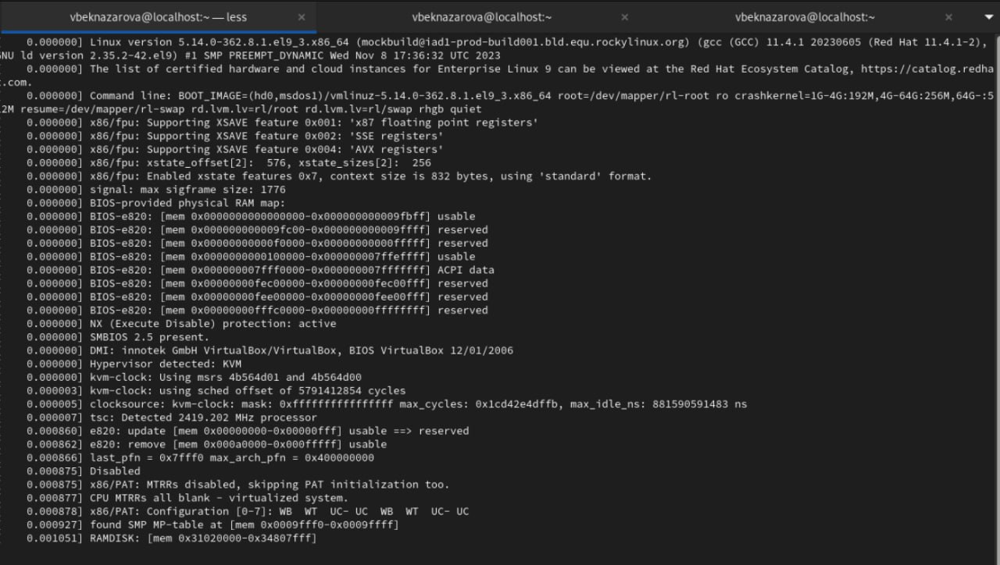
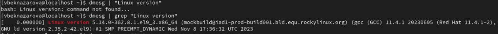
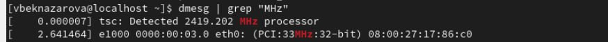
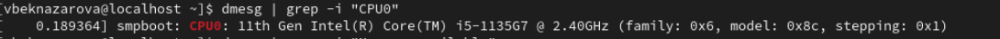
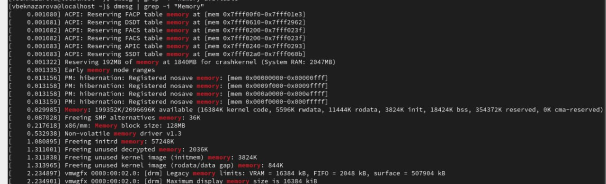
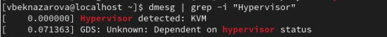
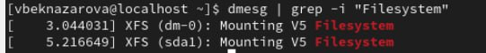
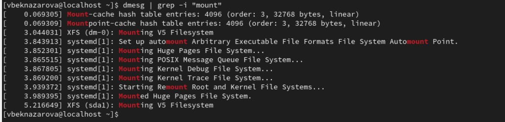

---
## Front matter
lang: ru-RU
title: Лабораторная работа №1
subtitle: Основы информационной безопасности 
author:
  - Бекназарова Виктория Тиграновна
institute:
  - Российский университет дружбы народов, Москва, Россия
date: 17 февраля 2024

## i18n babel
babel-lang: russian
babel-otherlangs: english

## Formatting pdf
toc: false
toc-title: Содержание
slide_level: 2
aspectratio: 169
section-titles: true
theme: metropolis
header-includes:
 - \metroset{progressbar=frametitle,sectionpage=progressbar,numbering=fraction}
 - '\makeatletter'
 - '\beamer@ignorenonframefalse'
 - '\makeatother'
---


# Вводная часть

## Актуальность


Установка Rocky Linux.


## Цели и задачи

Целью данной работы является приобретение практических навыков установки операционной системы на виртуальную машину, настройки минимально необходимых для дальнейшей работы сервисов.


## Материалы и методы

- Процессор `pandoc` для входного формата Markdown
- Результирующие форматы
	- `pdf`
	- `html`
- Автоматизация процесса создания: `Makefile`

# Создание презентации

## Процессор `pandoc`

- Pandoc: преобразователь текстовых файлов
- Сайт: <https://pandoc.org/>
- Репозиторий: <https://github.com/jgm/pandoc>

## Формат `pdf`

- Использование LaTeX
- Пакет для презентации: [beamer](https://ctan.org/pkg/beamer)
- Тема оформления: `metropolis`

## Код для формата `pdf`

```yaml
slide_level: 2
aspectratio: 169
section-titles: true
theme: metropolis
```

## Формат `html`

- Используется фреймворк [reveal.js](https://revealjs.com/)
- Используется [тема](https://revealjs.com/themes/) `beige`

## Код для формата `html`

- Тема задаётся в файле `Makefile`

```make
REVEALJS_THEME = beige 
```

## Содержание исследования

Загружаю установленную систему .

{#fig:001 width=95%}

##

1. Анализирую последовательность загрузки системы 

{#fig:002 width=95%}

##

2. Версия ядра .
 
{#fig:003 width=95%}

##

3. Частота процессора .

{#fig:004 width=95%}

##

4. Модель процессора .

{#fig:005 width=95%}

##

5. Объем доступной оперативной памяти.

{#fig:006 width=95%}

##

6. Тип обнаруженного гипервизора.

{#fig:007 width=95%}

##

7. Тип файловой системы корневого раздела.

{#fig:008 width=95%}

##


8. Последовательность монтирования файловых систем.

{#fig:009 width=95%}


## Результаты

В ходе выполнения лабораторной работы я установила Rocky Linux. 


## Итоговый слайд

Я приобрела практические навыки установки и конфигурации операционной системы на виртуальную машину.
