---
## Front matter
title: "Лабораторная работа №5"
subtitle: "Основы информационной безопасности"
author: "Сабралиева Марворид Нуралиевна"

## Generic otions
lang: ru-RU
toc-title: "Содержание"

## Bibliography
bibliography: bib/cite.bib
csl: pandoc/csl/gost-r-7-0-5-2008-numeric.csl

## Pdf output format
toc: true # Table of contents
toc-depth: 2
lof: true # List of figures
lot: true # List of tables
fontsize: 12pt
linestretch: 1.5
papersize: a4
documentclass: scrreprt
## I18n polyglossia
polyglossia-lang:
  name: russian
  options:
	- spelling=modern
	- babelshorthands=true
polyglossia-otherlangs:
  name: english
## I18n babel
babel-lang: russian
babel-otherlangs: english
## Fonts
mainfont: PT Serif
romanfont: PT Serif
sansfont: PT Sans
monofont: PT Mono
mainfontoptions: Ligatures=TeX
romanfontoptions: Ligatures=TeX
sansfontoptions: Ligatures=TeX,Scale=MatchLowercase
monofontoptions: Scale=MatchLowercase,Scale=0.9
## Biblatex
biblatex: true
biblio-style: "gost-numeric"
biblatexoptions:
  - parentracker=true
  - backend=biber
  - hyperref=auto
  - language=auto
  - autolang=other*
  - citestyle=gost-numeric
## Pandoc-crossref LaTeX customization
figureTitle: "Рис."
tableTitle: "Таблица"
listingTitle: "Листинг"
lofTitle: "Список иллюстраций"
lotTitle: "Список таблиц"
lolTitle: "Листинги"
## Misc options
indent: true
header-includes:
  - \usepackage{indentfirst}
  - \usepackage{float} # keep figures where there are in the text
  - \floatplacement{figure}{H} # keep figures where there are in the text
---

# Цель работы

Изучение механизмов изменения идентификаторов, применения
SetUID- и Sticky-битов. Получение практических навыков работы в кон-
соли с дополнительными атрибутами. Рассмотрение работы механизма
смены идентификатора процессов пользователей, а также влияние бита
Sticky на запись и удаление файлов.

# Выполнение лабораторной работы

## Подготовка
1. Для выполнения части заданий потребуются средства разработки приложений. В частности, при подготовке стенда следует убедиться, что в системе установлен компилятор gcc. У меня его не было, поэтому я установила компилятор
2. Система защиты SELinux не должна мешать выполнению заданий работы. Если вы не знаете, что это такое, просто отключите систему запретов до очередной перезагрузки системы командой setenforce 0
3. Команда getenforce выводит Permissive.

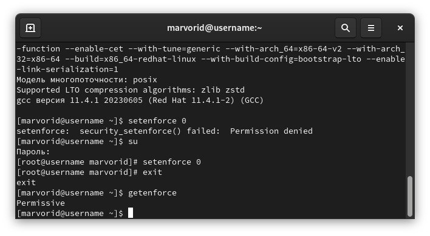{#fig:001 width=90%}

## Изучение механики SetUID

1. Вошли в систему от имени пользователя guest. (рис. @fig:002).

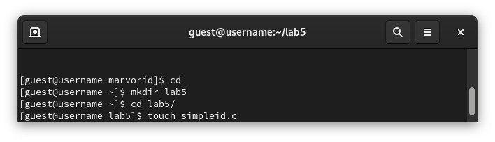{#fig:002 width=90%}

2. Создаем программу simpleid.c: (рис. @fig:003).

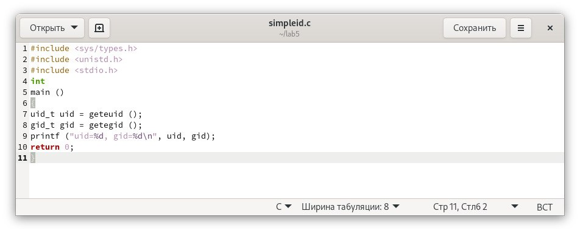{#fig:003 width=90%}

3. Скомплилируем программу и убедимся, что файл программы создан: gcc simpleid.c -o simpleid
4. Выполним программу simpleid: ./simpleid
5. Выполним системную программу id: id и сравните полученный вами результат с данными предыдущего пункта задания. uid и gid совпадают в обеих программах (рис. @fig:004).

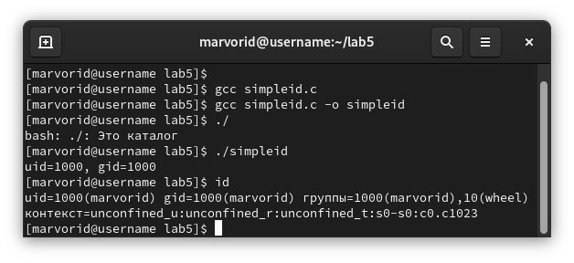{#fig:004 width=90%}

6. Усложним программу, добавив вывод действительных идентификаторов
Получившуюся программу назовем simpleid2.c. (рис. @fig:005).

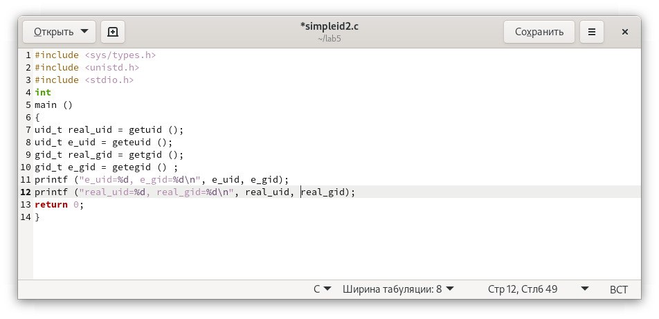{#fig:005 width=90%}

7. Скомпилируем и запустим simpleid2.c: gcc simpleid2.c -o simpleid2
./simpleid2 (рис. @fig:006).

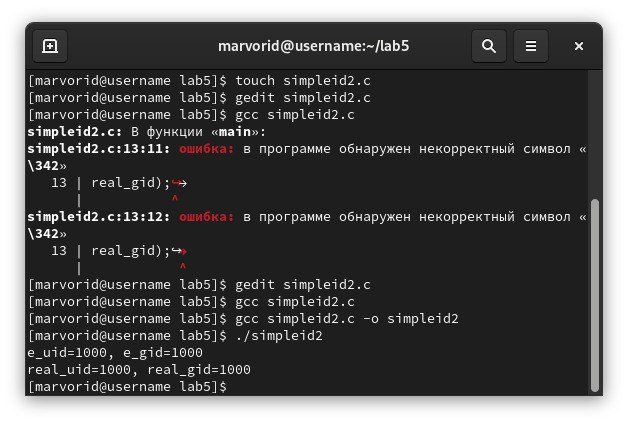{#fig:006 width=90%}

8. От имени суперпользователя выполним команды (рис. @fig:007): 
chown root:guest /home/guest/simpleid2
chmod u+s /home/guest/simpleid2  

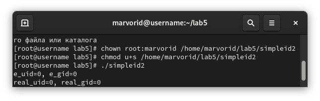{#fig:007 width=90%}

9. Используем su для повышения своих прав.
10. Выполним проверку правильности установки новых атрибутов и смены
владельца файла simpleid2: ls -l simpleid2
11. Запустим simpleid2 и id: ./simpleid2   id
Результаты выполнения теперь немного отличаются
12. Проделаем тоже самое относительно SetGID-бита. (рис. @fig:008).

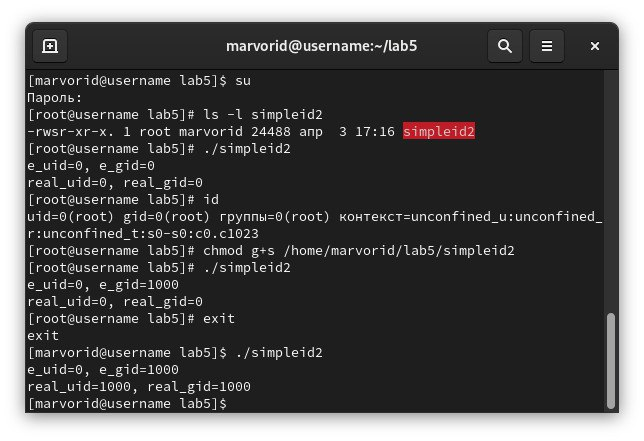{#fig:008 width=90%}

13. Создадим программу readfile.c (рис. @fig:009).

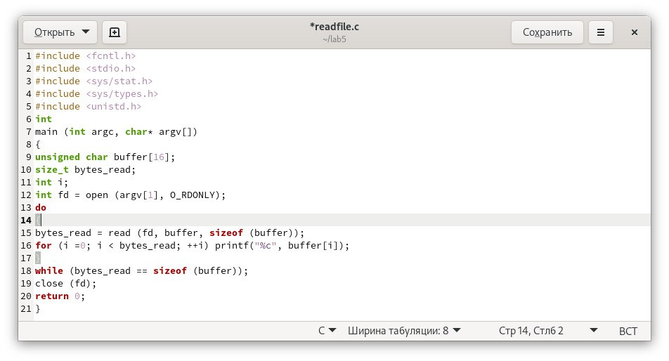{#fig:009 width=90%}

14. Откомпилируем её. gcc readfile.c -o readfile (рис. @fig:010).
15. Смениим владельца у файла readfile.c и изменим права так, чтобы только суперпользователь (root) мог прочитать его, a пользователь не мог.
16. Проверили, что пользователь не может прочитать файл readfile.c.
17. Сменим у программы readfile владельца и установим SetU’D-бит.
18. Проверили, может ли программа readfile прочитать файл readfile.c?
19. Проверили, может ли программа readfile прочитать файл /etc/shadow

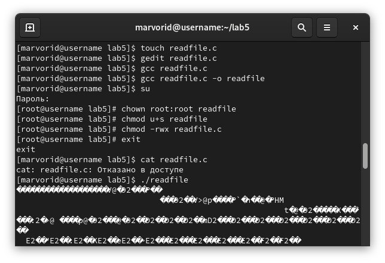{#fig:010 width=90%}

## Исследование Sticky-бита

1. Выяснили, что установлен атрибут Sticky на директории /tmp, для чего выполните команду ls -l / | grep tmp
2. От имени пользователя создали файл file01.txt в директории  tmp со словом test: echo "test" > /tmp/file01.txt
3. Просмотрели атрибуты у только что созданного файла и разрешили чтение и запись для категории пользователей «все остальные»:
ls -l /tmp/file01.txt
chmod o+rw /tmp/file01.txt
ls -l /tmp/file01.txt
4. От пользователя guest2 (не являющегося владельцем) попробовали прочитать файл /tmp/file01.txt: cat /tmp/file01.txt
5. От пользователя guest2 попробовали дозаписать в файл /tmp/file01.txt слово test2 командой echo "test2" > /tmp/file01.txt
операцию не удалась
6. Проверили содержимое файла командой cat /tmp/file01.txt
7. От пользователя guest2 попробовали записать в файл /tmp/file01.txt
слово test3, стерев при этом всю имеющуюся в файле информацию ко-
мандой echo "test3" > /tmp/file01.txt
8. Проверили содержимое файла командой cat /tmp/file01.txt
9. От пользователя guest2 попробовали удалить файл /tmp/file01.txt командой rm /tmp/fileOl.txt, но получили отказ
10. Повысили свои права до суперпользователя следующей командой
su - и выполнили после этого команду, снимающую атрибут t (Sticky-бит) с директории /tmp: chmod -t /tmp
11. Покинули режим суперпользователя командой exit
12. От пользователя guest2 проверили, что атрибута t у директории /tmp
нет: ls -l / | grep tmp
13. Повторили предыдущие шаги. 
14. Удалось удалить файл от имени пользователя не являющегося владельцем.

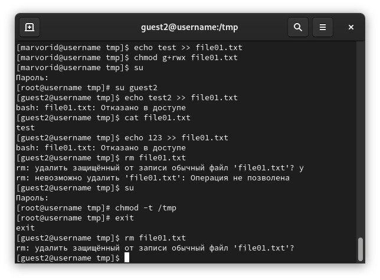{#fig:011 width=90%}

15. Повысили свои права до суперпользователя и вернули атрибут t на директорию /tmp: su -
chmod +t /tmp
exit

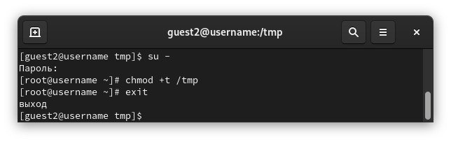{#fig:012 width=90%}

# Выводы

Изучили механизмы изменения идентификаторов, применения
SetUID- и Sticky-битов. 
Получмли практические навыки работы в консоли с дополнительными атрибутами. 
Рассмотрели работы механизма смены идентификатора процессов пользователей, а также влияние бита Sticky на запись и удаление файлов

# Список литературы{.unnumbered}

::: {#refs}
:::
