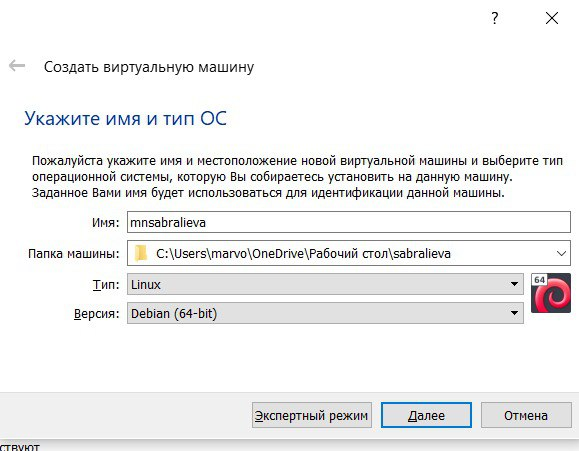
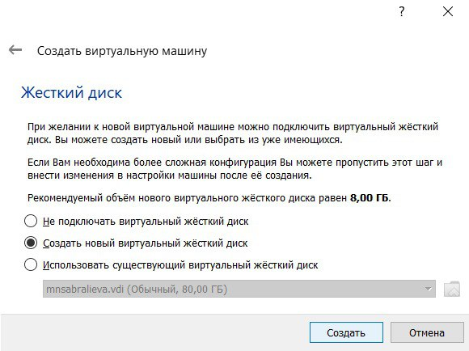
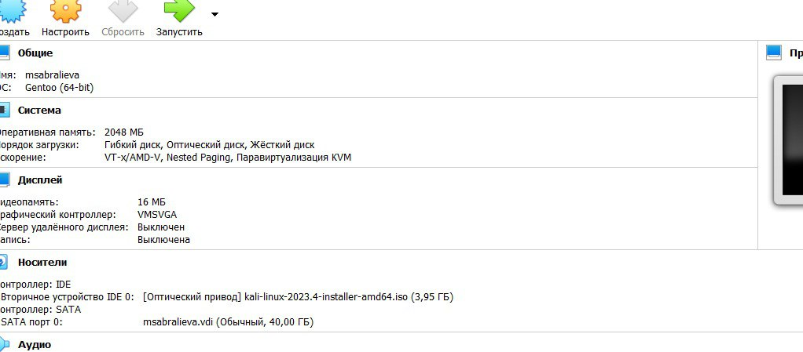
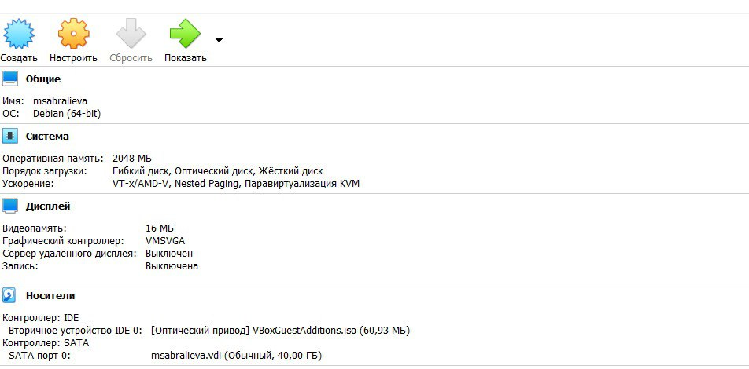

---
## Front matter
lang: ru-RU
title: Индивидуальный проект - Часть 1
subtitle: Основы Информационной безопасности
author:
  - Сабралиева М. Н.
institute:
  - Российский университет дружбы народов, Москва, Россия

## i18n babel
babel-lang: russian
babel-otherlangs: english

## Formatting pdf
toc: false
toc-title: Содержание
slide_level: 2
aspectratio: 169
section-titles: true
theme: metropolis
header-includes:
 - \metroset{progressbar=frametitle,sectionpage=progressbar,numbering=fraction}
 - '\makeatletter'
 - '\beamer@ignorenonframefalse'
 - '\makeatother'
---

# Информация

## Докладчик

:::::::::::::: {.columns align=center}
::: {.column width="70%"}

  * Сабралиева Марворид Нуралиевна
  * студент кафедры прикладной информатики и теории вероятностей НБИбд-01-22
  * Российский университет дружбы народов

:::
::::::::::::::

# Создание презентации

## Процессор `pandoc`

- Pandoc: преобразователь текстовых файлов
- Сайт: <https://pandoc.org/>
- Репозиторий: <https://github.com/jgm/pandoc>

## Формат `pdf`

- Использование LaTeX
- Пакет для презентации: [beamer](https://ctan.org/pkg/beamer)
- Тема оформления: `metropolis`

## Код для формата `pdf`

```yaml
slide_level: 2
aspectratio: 169
section-titles: true
theme: metropolis
```

## Формат `html`

- Используется фреймворк [reveal.js](https://revealjs.com/)
- Используется [тема](https://revealjs.com/themes/) `beige`

## Код для формата `html`

- Тема задаётся в файле `Makefile`

```make
REVEALJS_THEME = beige 
```

# Элементы презентации


## Цели и задачи

- Установить дистрибутив Kali Linux в виртуальную машину

## Содержание исследования

1. Создадим виртуальную машину: тип ОС - Linux, версия - Debian.

{#fig:001 width=90%}

##

2. Зададим нужные нам настройки и создадим жесткий диск.

{#fig:002 width=90%}

##

3. Добавим в оптический привод ранее скачанный нами kali-linux и запустим машину

{#fig:003 width=90%}

##

4. Проведем первичную настройку машины: установим язык, регион и настроим другие параметры. После того как загрузка закончится подключим образ диска дополнительной ОС. Теперь можно полноценно пользоваться машиной.

{#fig:004 width=90%}


## Результаты

- Установили дистрибутив Kali Linux в виртуальную машину.
- Создали базу для дальнейшего использования


## Итоговый слайд

- Запоминается последняя фраза. © Штирлиц

:::

