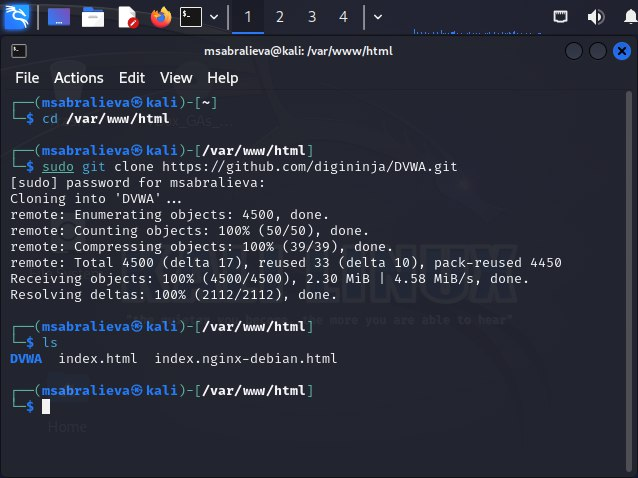
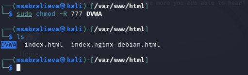
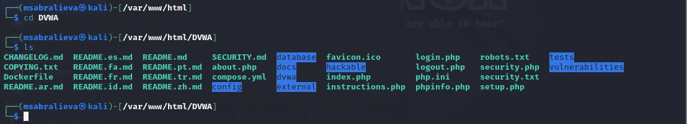
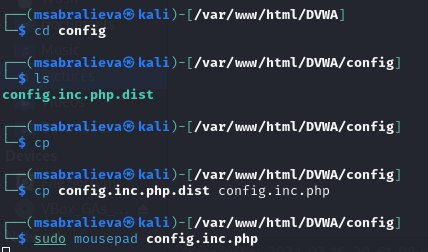
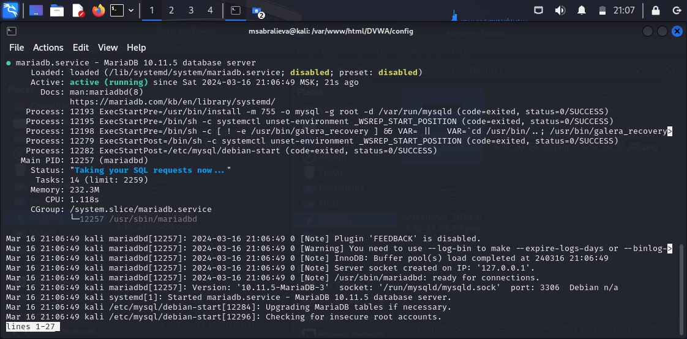
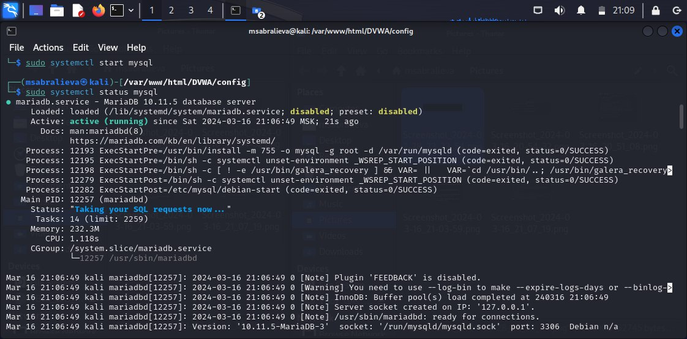
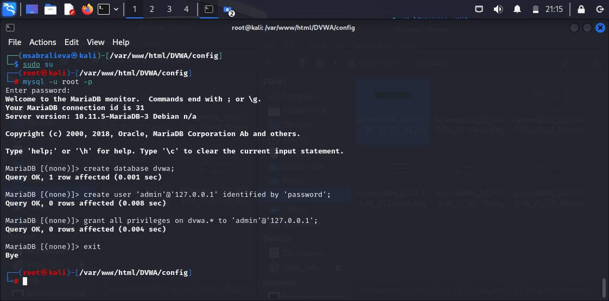
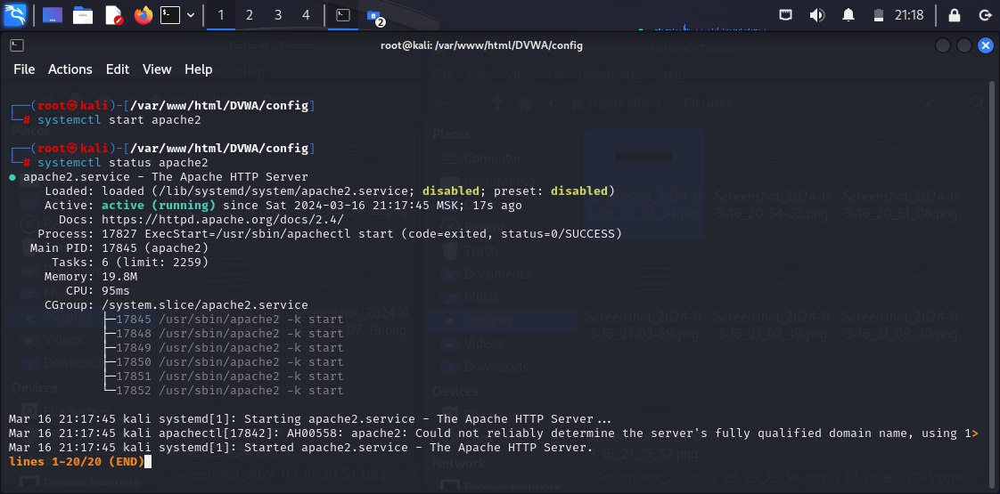
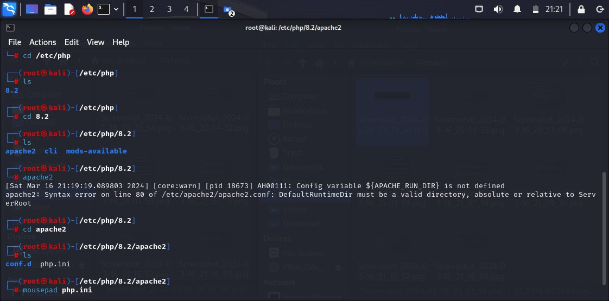
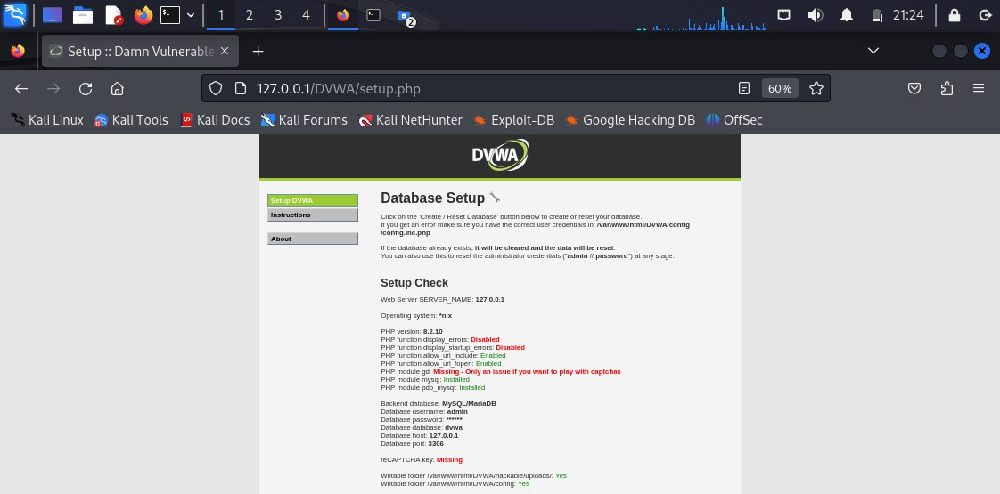

---
## Front matter
lang: ru-RU
title: Индивидуальный проект этап2
subtitle: Основы информационной безопасноти
author:
  - Сабралиева М. Н.
institute:
  - Российский университет дружбы народов, Москва, Россия

## i18n babel
babel-lang: russian
babel-otherlangs: english

## Formatting pdf
toc: false
toc-title: Содержание
slide_level: 2
aspectratio: 169
section-titles: true
theme: metropolis
header-includes:
 - \metroset{progressbar=frametitle,sectionpage=progressbar,numbering=fraction}
 - '\makeatletter'
 - '\beamer@ignorenonframefalse'
 - '\makeatother'
---

# Информация

## Докладчик

:::::::::::::: {.columns align=center}
::: {.column width="70%"}

  * Сабралиева Марворид Нуралиевна
  * студентка НБИбд-01-22
  * кафедры прикладной информатики и теории вероятностей
  * Российский университет дружбы народов
:::
::::::::::::::

# Создание презентации

## Формат `pdf`

- Использование LaTeX
- Пакет для презентации: [beamer](https://ctan.org/pkg/beamer)
- Тема оформления: `metropolis`

## Код для формата `pdf`

```yaml
slide_level: 2
aspectratio: 169
section-titles: true
theme: metropolis
```

## Формат `html`

- Используется фреймворк [reveal.js](https://revealjs.com/)
- Используется [тема](https://revealjs.com/themes/) `beige`

## Код для формата `html`

- Тема задаётся в файле `Makefile`

```make
REVEALJS_THEME = beige 
```

# Элементы презентации

## Цели и задачи

- Установить DVWA в гостевую систему к Kali Linux.

## Содержание исследования

Установим DVWA в гостевую систему к Kali Linux с помощью клонирования из гитхаба и проведем дальнейшую установку

{#fig:001 width=90%}

##

{#fig:002 width=90%}

##

{#fig:003 width=90%}

##

{#fig:004 width=90%}

##

{#fig:005 width=90%}

##

{#fig:006 width=90%}

##

{#fig:007 width=90%}

##

{#fig:008 width=90%}

##

{#fig:009 width=90%}

##

{#fig:010 width=90%}


## Результаты

- В ходе выполнения данного этапы мы установили DVWA в гостевую систему к Kali Linux


## Итоговый слайд

- Запоминается последняя фраза. © Штирлиц

:::

